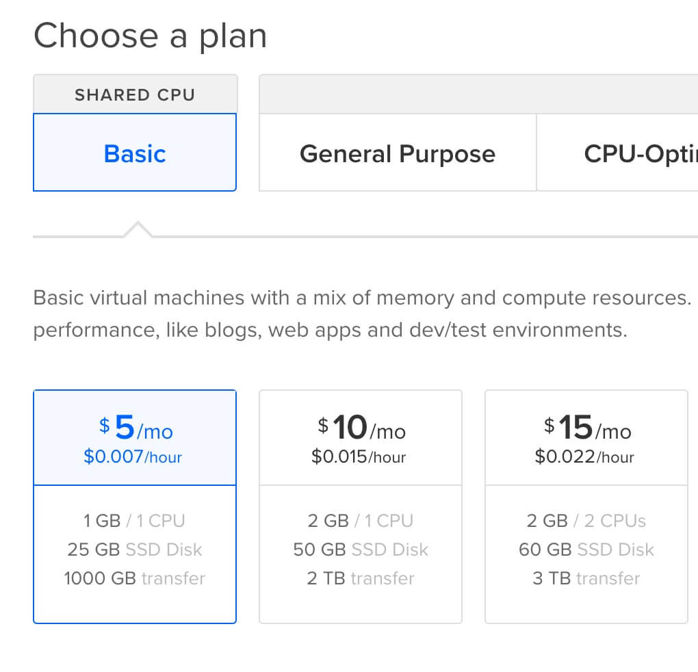
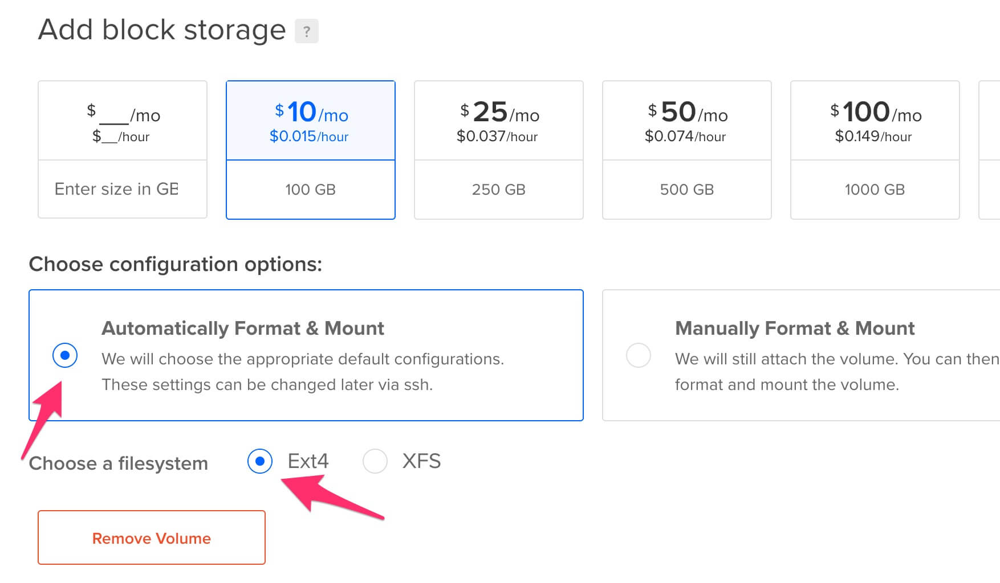
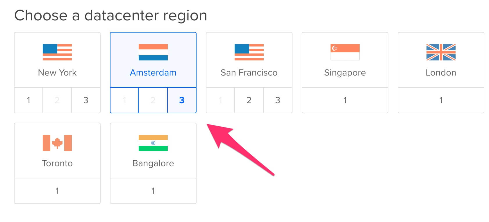
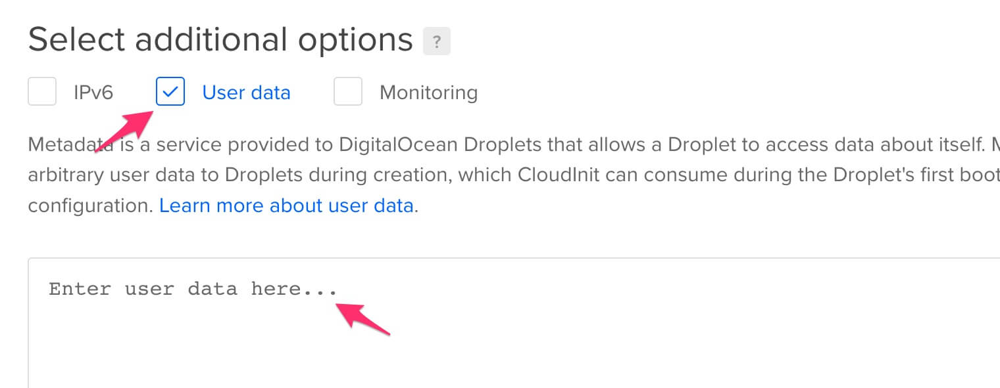
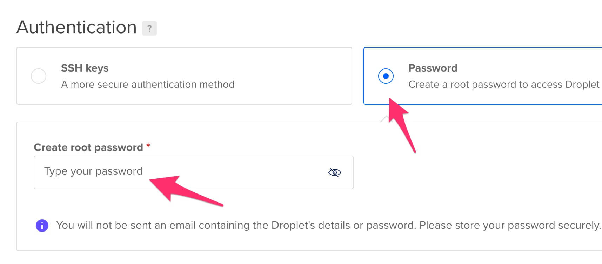
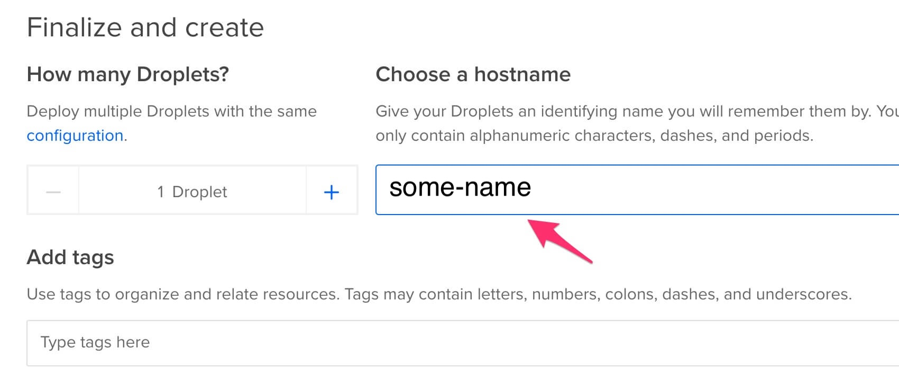
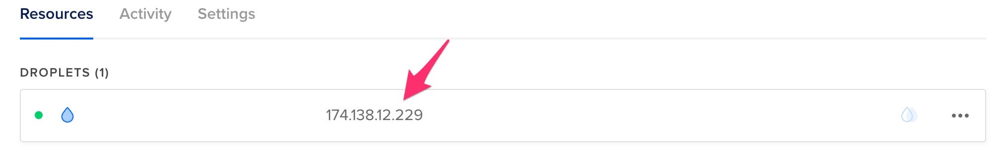

How to Deploy FluxOmni to DigitalOcean
=======================================

This guide provides a common and recommended way to deploy the FluxOmni streamer application as a standalone droplet on [DigitalOcean].

## 0. Prerequisites

You should have a registered account on [DigitalOcean] with a [payment method attached to it][1].

## 1. Create Droplet

Open the [droplet creation page][2].

### 1.1. Choose an Image

Select **Ubuntu 24.04 LTS**.

> __WARNING__: Using other images or versions is not recommended and may not be supported.

### 1.2. Choose a Plan

For simple restreaming, the cheapest plan should be sufficient. If you plan to run a large number of streams or require transcoding, consider a more powerful plan.



### 1.3. Add Volume (Optional)

> __NOTE__: Skip this step if you do not plan to record streams to files.

If you intend to record live streams, you may need more disk space than the default provided. You can attach an external block storage volume to the droplet.




The installer will automatically detect and use the attached volume for FluxOmni.

### 1.4. Choose a Datacenter Region

Select a region that is geographically close to both your stream source and your destination endpoints to minimize latency.



### 1.5. Add User Data

To automatically install FluxOmni on the new droplet, paste the following script into the `User data` field. This runs once when the droplet is first created and also configures a firewall with the required ports.

```bash
#!/bin/bash
curl -fsSL https://install.fluxomni.io | WITH_UFW=1 bash -s
```



### 1.6. Select Authentication Method

[DigitalOcean] requires an authentication method to access the droplet. You can use an [SSH] key (recommended) or set a root password. This is for managing the server itself; it is not required for using the FluxOmni application.



### 1.7. Finalize and Create

Choose a hostname for your droplet to easily identify it later. You can leave the other settings at their defaults.



Click **Create Droplet** to begin provisioning.

## 2. Access FluxOmni

After you launch the droplet, allow 5-15 minutes for the provisioning and installation to complete.

You can find the IP address of your droplet in the DigitalOcean control panel.



Open your web browser and navigate to the IP address of the droplet.


Current releases serve the operator UI from the `control-plane` container directly.
Use `/routes` for route management and `/fleet` to inspect attached media nodes.

> __NOTE__: By default, FluxOmni is served over `http://`. For production use, it is highly recommended to set up a domain name and configure a reverse proxy (e.g., Nginx or Caddy) to enable `https://` for secure access.

[DigitalOcean]: https://digitalocean.com
[SSH]: https://en.wikipedia.org/wiki/SSH_(Secure_Shell)

[1]: https://cloud.digitalocean.com/account/billing
[2]: https://cloud.digitalocean.com/droplets/new
