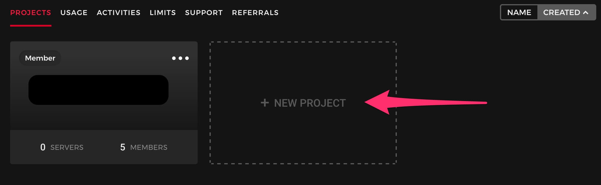
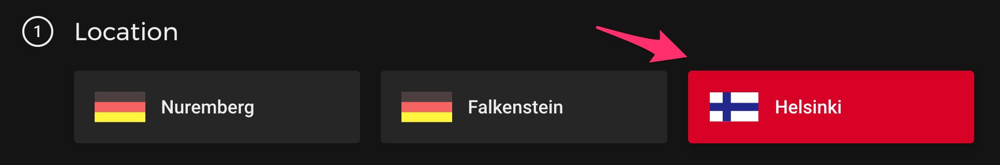
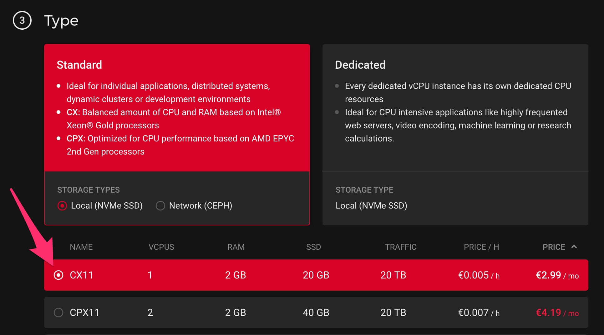
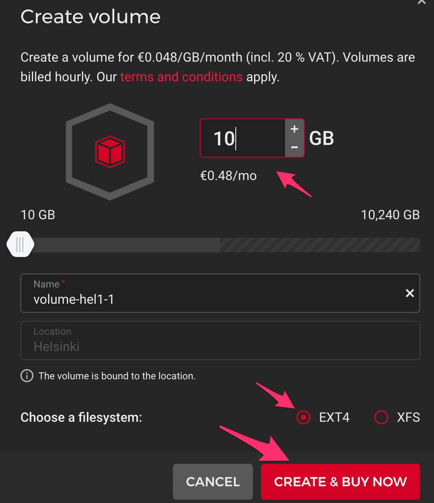
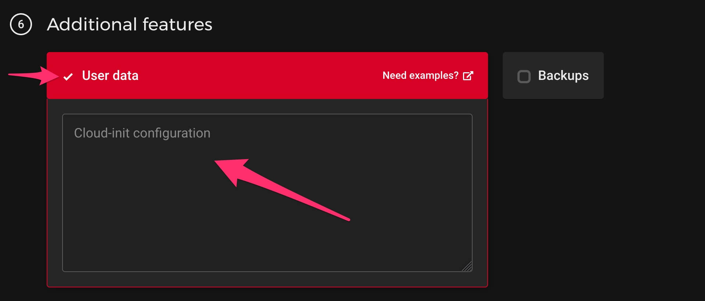
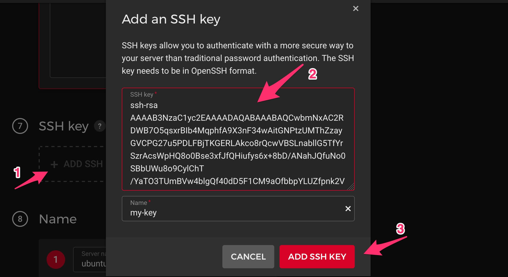
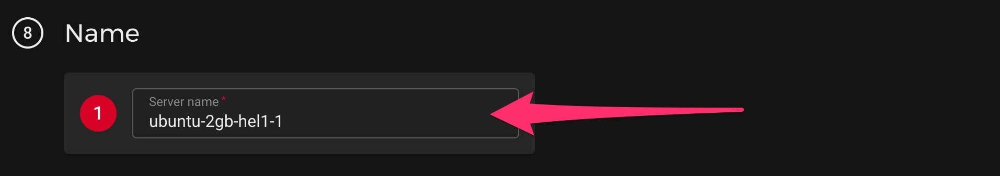
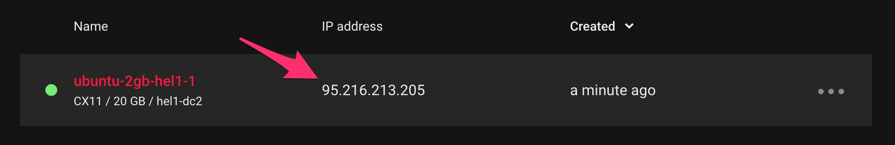

How to Deploy FluxOmni to Hetzner Cloud
=========================================

This guide provides a common and recommended way to deploy FluxOmni as a standalone server on [Hetzner Cloud].

## 0. Prerequisites

You should have a registered account on [Hetzner Cloud] with a [payment method attached][1] and a [Project] created.



## 1. Create Server

From your project dashboard, click to create a new server.

### 1.1. Choose a Location

Select a location that is geographically close to both your stream source and your destination endpoints to minimize latency.



### 1.2. Choose an Image

Select **Ubuntu 24.04**.

> **WARNING**: Windows is not supported. Ubuntu 24.04 is the recommended and tested OS. Other *nix systems with Docker may work but are not officially supported.

### 1.3. Choose a Type

For simple restreaming, the cheapest plan (e.g., `CX11`) should be sufficient. If you plan to run a large number of streams or require transcoding, consider a more powerful server type.



### 1.4. Add Volume (Optional)

> __NOTE__: Skip this step if you do not plan to record streams to files.

If you intend to record live streams, you may need more disk space than the default provided. You can attach an external volume to the server.




The installer will automatically detect and use the attached volume for FluxOmni.

### 1.5. Add User Data

To automatically install FluxOmni on the new server, paste the following script into the `User data` field. This runs once when the server is first created and also configures a firewall with the required ports.

```bash
#!/bin/bash
curl -fsSL https://install.fluxomni.io | WITH_UFW=1 bash -s
```



### 1.6. Add an SSH Key

[Hetzner Cloud] requires an [SSH] key to access the server. This is for managing the server itself; it is not required for using the FluxOmni application.



### 1.7. Finalize and Create

Choose a name for your server to easily identify it later. You can leave the other settings at their defaults.



Click **Create & Buy Now** to begin provisioning.

## 2. Access FluxOmni

After you launch the server, allow 5-15 minutes for the provisioning and installation to complete.

You can find the IP address of your server in the Hetzner Cloud console.



Open your web browser and navigate to the IP address of the server.


Current releases serve the operator UI from the `control-plane` container directly.
Use `/routes` for route management and `/fleet` to inspect attached media nodes.

> __NOTE__: By default, FluxOmni is served over `http://`. For production use, it is highly recommended to set up a domain name and configure a reverse proxy (e.g., Nginx or Caddy) to enable `https://` for secure access.

[Hetzner Cloud]: https://hetzner.com/cloud
[Project]: https://console.hetzner.cloud/projects
[SSH]: https://en.wikipedia.org/wiki/SSH_(Secure_Shell)

[1]: https://accounts.hetzner.com/account/payment
