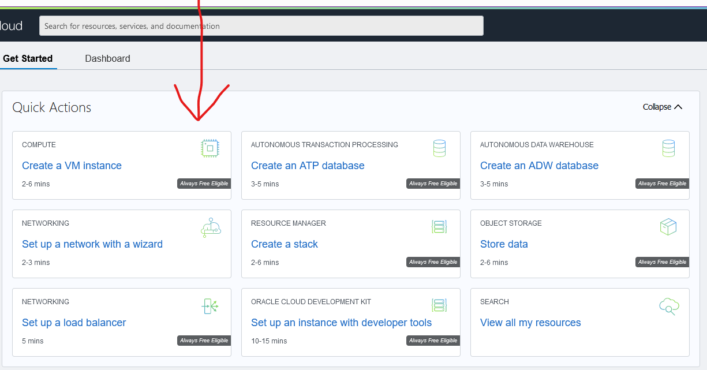
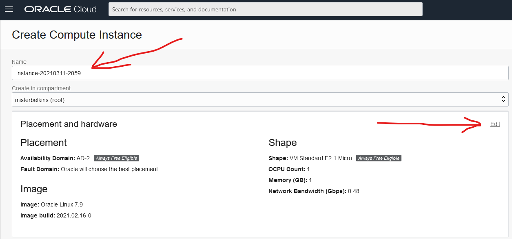
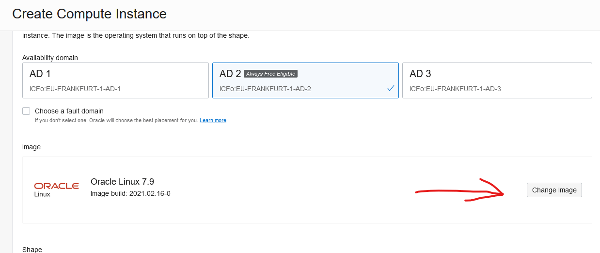
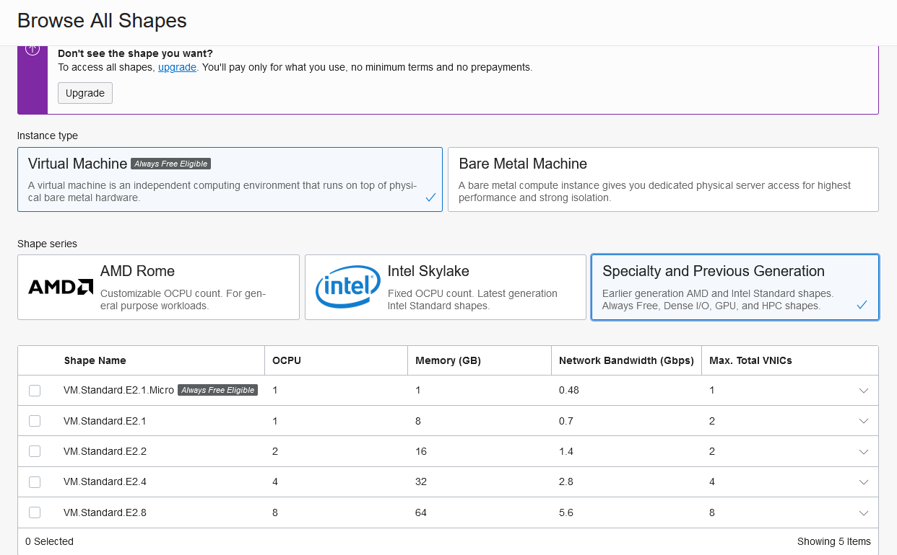
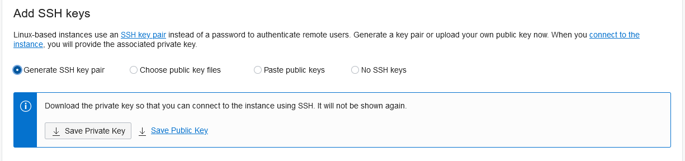
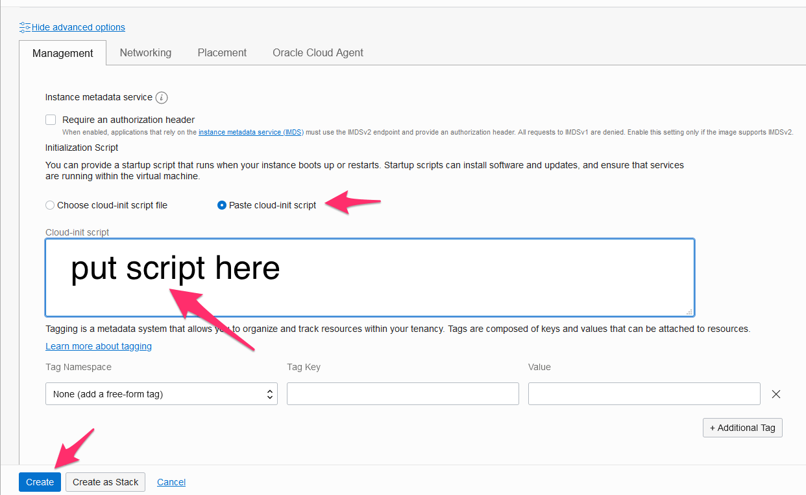
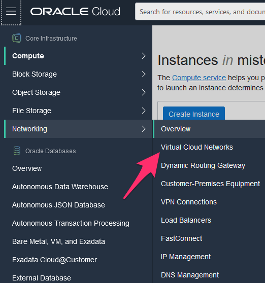
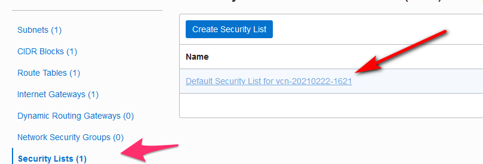
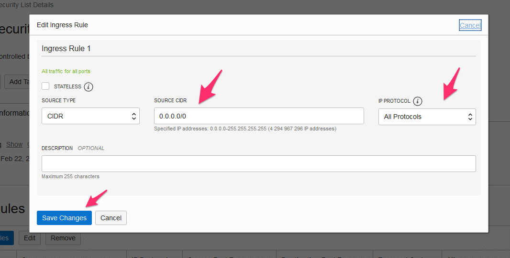
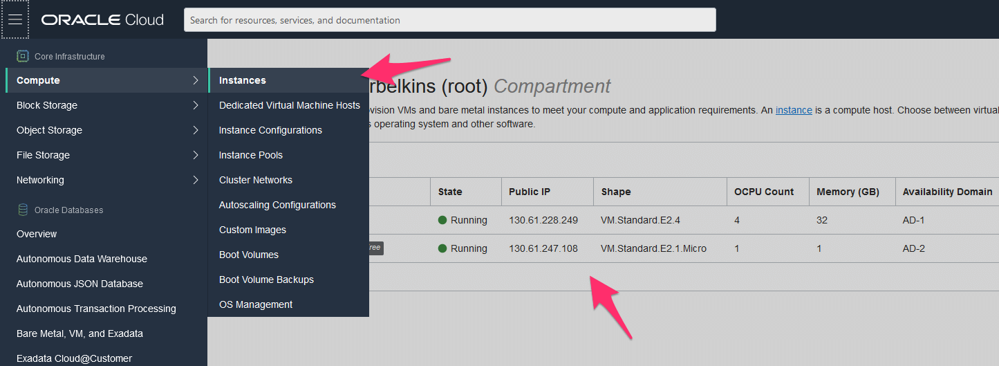

How to Deploy FluxOmni to Oracle Cloud Infrastructure
====================================================

This guide provides a common and recommended way to deploy the FluxOmni streamer application as a standalone instance on [Oracle Cloud Infrastructure] (OCI).

OCI can be a cost-effective option due to its [Free Tier] instances. However, be aware that their resources and bandwidth are limited and may not be suitable for a large number of high-bitrate streams.

> __NOTE__: The official bandwidth for a Free Tier VM instance is often higher than the real-world performance. Expect around 50 Mbps, which is enough for up to 8 streams at 5000 kbps each.

## 0. Prerequisites

You should have a registered account on [Oracle Cloud Infrastructure]. The registration process can be lengthy and requires careful data entry.

## 1. Create VM Instance

From the OCI console, select **Create a VM instance**.



### 1.1. Name and Compartment

Choose a name for your instance. Then, click **Edit** in the "Placement and hardware" section to customize the configuration.



### 1.2. Choose an Image

Click **Change image** and select **Canonical Ubuntu 24.04**.



> __WARNING__: Using other images or versions is not recommended and may not be supported.

### 1.3. Choose a Shape

For simple restreaming, a [Free Tier] eligible shape (e.g., `VM.Standard.A1.Flex`) should be sufficient. For more demanding workloads, choose a more powerful shape.



### 1.4. Add SSH Keys

You can add an [SSH] key to access the instance for server administration. This is not required for using the FluxOmni application itself. If you do not wish to add a key, you can select "No SSH keys".



### 1.5. Use Cloud-Init Script

Expand the **Show advanced options** section. Go to the **Management** tab and paste the following script into the `Cloud-init script` field. This runs once when the instance is first created, configures the OS-level firewall (firewalld), and installs FluxOmni.

```bash
#!/bin/bash
curl -fsSL https://install.fluxomni.io | WITH_FIREWALLD=1 bash -s
```



Click **Create** to begin provisioning the VM instance.

## 2. Configure Networking

By default, OCI instances have a restrictive firewall. You must create ingress rules to allow traffic to FluxOmni.

### 2.1. Navigate to Virtual Cloud Network

Go to your instance's details page, and click the link to its **Virtual Cloud Network**.



### 2.2. Edit the Security List

Navigate to **Security Lists** and click on the default security list for your network.



### 2.3. Add Ingress Rules

Remove the existing stateful ingress rule for port 22 (or edit it if you need SSH access). Then, add a new ingress rule with the following settings:

- **Source Type**: CIDR
- **Source CIDR**: `0.0.0.0/0`
- **IP Protocol**: All Protocols

This allows all incoming traffic to your instance. For a production environment, you should create more restrictive rules that only allow traffic on the necessary ports (e.g., 80 for HTTP, 1935 for RTMP, 8000/tcp for SRS HTTP, 8000/udp for WebRTC, and 10080/udp for SRT).



## 3. Access FluxOmni

After the instance is created and the networking is configured, allow 5-15 minutes for the provisioning and installation to complete.

Find the **Public IP address** on the instance details page.



Open your web browser and navigate to the IP address.


Current releases serve the operator UI from the `control-plane` container directly.
Use `/routes` for route management and `/fleet` to inspect attached media nodes.

> __NOTE__: By default, FluxOmni is served over `http://`. For production use, it is highly recommended to set up a domain name and configure a reverse proxy (e.g., Nginx or Caddy) to enable `https://` for secure access.

[Free Tier]: https://www.oracle.com/cloud/free
[Oracle Cloud Infrastructure]: https://www.oracle.com/cloud
[SSH]: https://en.wikipedia.org/wiki/SSH_(Secure_Shell)
