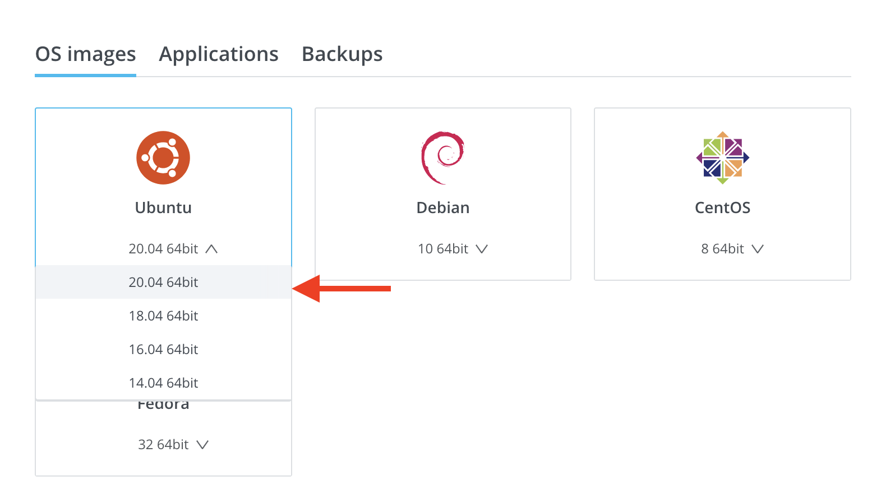
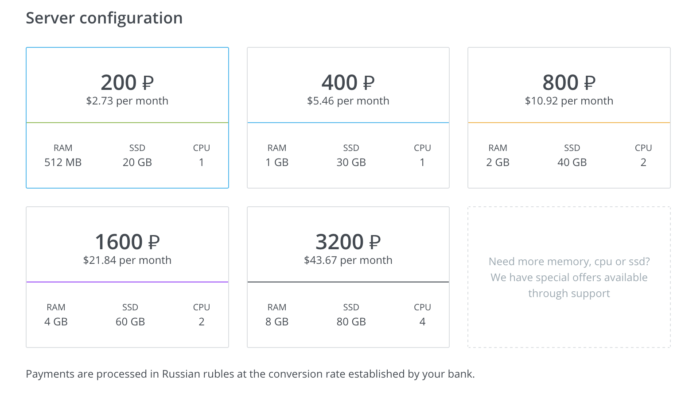
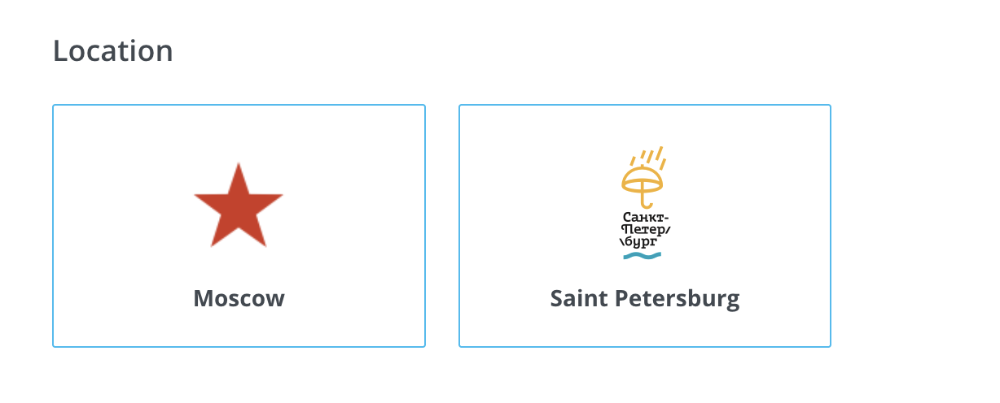
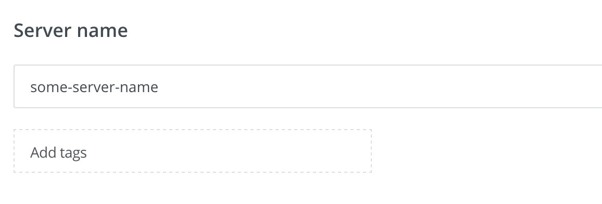
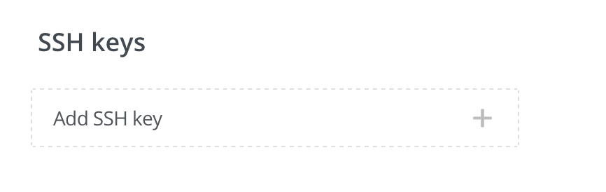
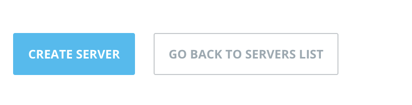
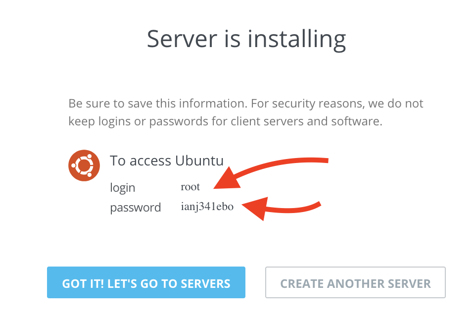
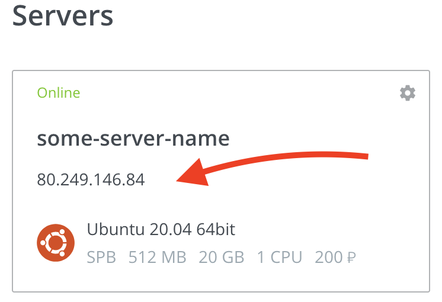
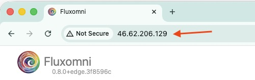

# How to Deploy FluxOmni to VScale/Selectel Cloud

This guide provides the recommended method for deploying the FluxOmni streamer application to [VScale/Selectel Cloud].

This provider is a good option for users who need servers in Moscow or St. Petersburg.

> **NOTE**: This installation method requires accessing the server via SSH.

## 0. Prerequisites

You must have a registered account with [VScale/Selectel Cloud] and a positive account balance.

## 1. Create a Virtual Server

After logging in, open the "[Servers]" page, select "[Create another instance]", and choose the **Ubuntu 24.04** image.



> **WARNING**: Other operating systems are not supported! Please select Ubuntu 24.04.

### 1.1. Choose a Configuration

For simple restreaming, the smallest configuration is usually sufficient. If you plan to run a large number of streams, consider a more powerful server.



### 1.2. Choose a Location

Choose a location that is geographically close to both your stream source and destination endpoints to minimize latency.



### 1.3. Set the Server Name

Give your server a descriptive name so you can easily identify it later.



### 1.4. Configure SSH Access (Optional)

You can create the server without an [SSH] key, in which case a password will be provided for the `root` user.

If you want to use an SSH key, you can add your public key during server creation.



### 1.5. Create the Server

After configuring the options, click "CREATE SERVER".



If you did not provide an SSH key, you will be given a username and password. You will need these to log in to the server.



### 1.6. Install FluxOmni

To install FluxOmni, you need to connect to the server using an [SSH] client and run the installation script.

Find the IP address of your server. In this example, it is `80.249.146.84`.



Connect to your server via SSH and run the following command. Replace `your_server_ip` with the actual IP address of your server.

```bash
ssh root@your_server_ip "curl -fsSL https://raw.githubusercontent.com/fluxomnia-systems/fluxomni-selfhost/main/provision.sh | FLUXOMNI_VERSION=edge WITH_INITIAL_UPGRADE=1 bash -s"
```

If you are using password authentication, you will be prompted to enter the password from the previous step.

## 2. Access FluxOmni

After the installation script is finished (it may take 5-15 minutes), you can access FluxOmni by navigating to the server's IP address in your web browser.



> **NOTE**: By default, FluxOmni is served over `http://`. For production use, it is highly recommended to set up a domain name and configure a reverse proxy (e.g., Nginx or Caddy) to enable `https://` for secure access.

[Servers]: https://vscale.io/panel/scalets/
[Create another instance]: https://vscale.io/panel/scalets/new/
[VScale/Selectel Cloud]: https://vscale.io
[SSH]: https://en.wikipedia.org/wiki/SSH_(Secure_Shell)
