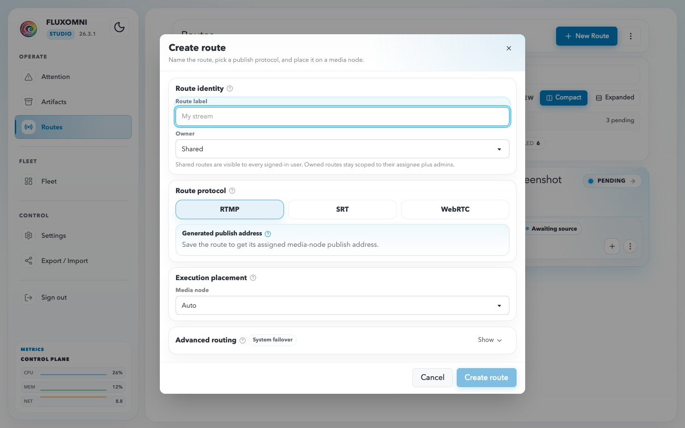
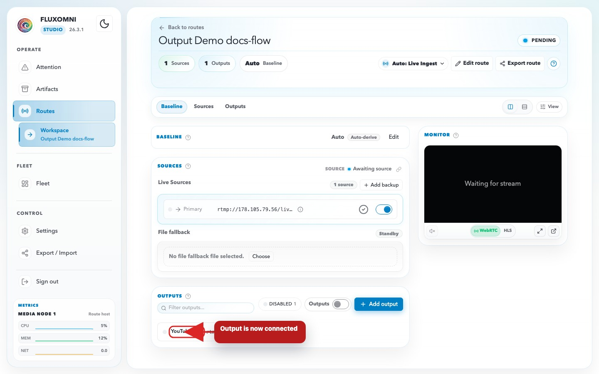

# First Stream

Use this tutorial after [installing Fluxomni Studio](quick-start.md) to create a protected operator account, accept one RTMP stream, send it to one destination, and confirm that it is live.

## Before you begin

You need a running single-host installation and an encoder that can publish RTMP, such as OBS or FFmpeg. Open `http://<your-server-ip>/routes` in a browser.

This tutorial uses the default single-host media node. If you are deploying behind a domain or reverse proxy, configure the public host values first so generated ingest and playback URLs are usable. See [Configuration](configuration.md) and [Reverse Proxy & TLS](reverse-proxy.md).

## Create the first operator account

A new installation can initially open as an **Open shell**. Create a named account before using the instance for production:

1. In the sidebar, open **Settings**, then **Users**.
2. Enter a username, optional display name, and a strong password.
3. Select **Create user**.

The first persisted user becomes an Admin and enables named-user sign-in. Keep the credentials in your password manager. For the full account and role model, see [Settings](../user-guide/settings.md#users).

## Create an RTMP route

1. In the sidebar, open **Routes** and select **+ New Route**.
2. Enter a route label, such as `Main broadcast`.
3. Under **Primary Live Source**, choose **RTMP** and **Accept publish**.
4. Select **Create route**.

After Fluxomni Studio assigns the route to its media node, open the route workspace. In **Routing**, use the copy control in the input lane to copy the generated RTMP publish address.

## Configure your encoder

Paste the generated publish address into your encoder's RTMP publishing setting. Do not share this address publicly: it lets a publisher send media to this route.

Start publishing from the encoder. The route header and the playback monitor use **LIVE** when the route is actively carrying media. If the publish address is unavailable, wait for the route to receive a media-node assignment. If the route does not become live after publishing, confirm that TCP port 1935 is reachable and use [Troubleshooting](troubleshooting.md).

## Add one output

1. In the route workspace, open **Routing** and select **+ Add output**.
2. Paste the destination URL supplied by your streaming platform.
3. Optionally add a label that identifies the destination.
4. Save the output.

A real platform destination can begin receiving the stream as soon as the encoder publishes. Confirm the selected destination and its stream key before you start the encoder.

Fluxomni Studio supports RTMP/RTMPS, SRT, Icecast, and file output destinations. Use an RTMP or RTMPS destination for a typical streaming platform.

## Verify the stream

Confirm all of the following before relying on the route:

- The route header shows **LIVE**.
- The **Live playback** panel shows **LIVE** and the expected outgoing stream when a playback URL is available.
- The destination has received the expected stream.
- [Attention](../user-guide/attention.md) has no active Critical alert for the route or its media node.

The [Routes guide](../user-guide/routes.md) explains the workspace, output states, preview, playlists, and route-level alerts in more detail.

## Protect your configuration

Create a backup after this first successful stream. From the install directory, stop the stack, archive `data/` and `.env`, then start the stack again as described in [Backup & Restore](backup.md).

## Next steps

- [Routes](../user-guide/routes.md) — add backups, playlists, and more outputs
- [Reverse Proxy & TLS](reverse-proxy.md) — serve the operator UI securely on a domain
- [Monitoring](monitoring.md) — monitor route and media-node health
- [Backup & Restore](backup.md) — establish a regular backup routine
