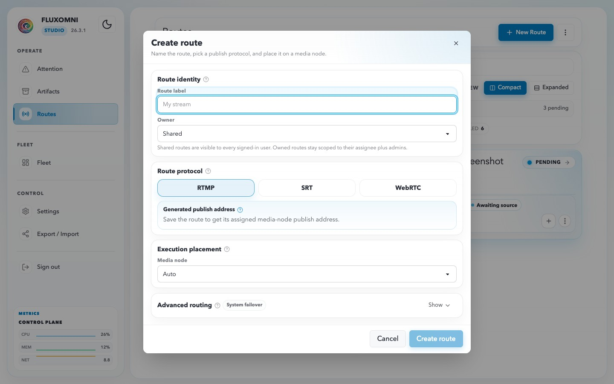
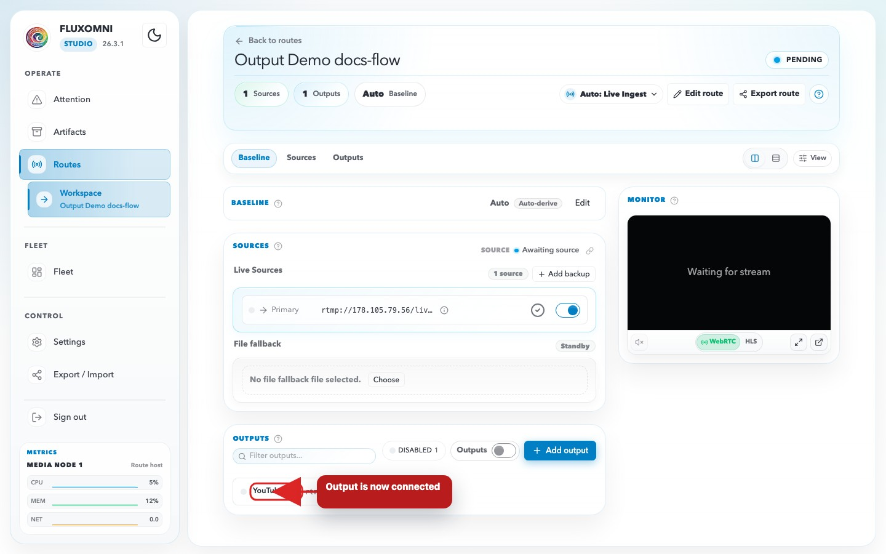

# First Stream

Use this tutorial after [installing Fluxomni Studio](quick-start.md) to create a protected operator account, accept one RTMP stream, send it to one destination, and confirm that it is live.

## Before you begin

You need a running single-host installation and an encoder that can publish RTMP, such as OBS or FFmpeg. Open `http://<your-server-ip>/routes` in a browser.

This tutorial uses the default single-host media node. If you are deploying behind a domain or reverse proxy, configure the public host values first so generated ingest and playback URLs are usable. See [Configuration](configuration.md) and [Reverse Proxy & TLS](reverse-proxy.md).

## Create the first operator account

A new installation can initially open as an **Open shell**. Create a named account before using the instance for production:

1. In the sidebar, open **Settings**, then **Users**.
2. Enter a username, optional display name, and a strong password.
3. Select **Create user**.

The first persisted user becomes an Admin and enables named-user sign-in. Keep the credentials in your password manager. For the full account and role model, see [Settings](../user-guide/settings.md#users).

## Create an RTMP route

1. In the sidebar, open **Routes** and select **+ New Route**.
2. Enter a route label, such as `Main broadcast`.
3. Under **Primary Live Source**, choose **RTMP** and **Accept publish**.
4. Select **Create route**.



After Fluxomni Studio assigns the route to its media node, open the route workspace. In **Routing**, use the copy control in the input lane to copy the generated RTMP publish address.

## Publish from OBS

Open the route workspace and copy the publish URL from **Sources → Live Sources**. For SRT or WebRTC, create the route with that protocol and **Accept publish** instead of RTMP. Use the copied URL, including any nonstandard port; an unavailable URL means the route or media node is not ready to accept that protocol.

### RTMP

In OBS, open **Settings → Stream** and select **Service: Custom**. Split the copied URL at the final `/`:

- Copied URL: `rtmp://media.example.com:1935/live/pk_example`
- **Server**: `rtmp://media.example.com:1935/live`
- **Stream Key**: `pk_example`

Use H.264 video and AAC audio, select **Apply**, then **Start Streaming**.

### SRT

In **Settings → Stream**, select **Service: Custom**, paste the **complete copied SRT URL** into **Server**, and leave **Stream Key** empty. Keep the `streamid` and any latency or passphrase parameters intact. OBS connects in caller mode by default.

Use H.264 video and AAC audio, select **Apply**, then **Start Streaming**. See the official [OBS SRT streaming guide](https://obsproject.com/kb/srt-protocol-streaming-guide).

### WebRTC / WHIP

In **Settings → Stream**, select **Service: WHIP** and paste the **complete copied HTTP WHIP URL** into **Server**, for example:

```text
http://media.example.com:8003/rtc/v1/whip/?app=live&stream=pk_example
```

Leave **Bearer Token** empty: Fluxomni includes the publishing credential in the URL's `stream` parameter. Use H.264 video and Opus audio, select **Apply**, then **Start Streaming**.

Choose **WHIP**, not **Custom**: pasting this HTTP URL into Custom leaves OBS using RTMP and causes a handshake failure. If WHIP is missing, use an OBS build that supports it. See the official [OBS WHIP streaming guide](https://obsproject.com/kb/whip-streaming-guide).

WHIP requires a media node with public gateway support. Both signaling TCP (default `8003`) and RTC media UDP (default `8000`) must be reachable from OBS, and the node must advertise a reachable ICE candidate. Use your deployment's actual ports; reaching the web UI alone does not establish media connectivity.

### Confirm publishing

The source should become live and the route monitor should show your media. If OBS reports **Failed to connect to server**, check the selected service, copied address, and reachable protocol ports. Keep publish URLs private: they authorize publishing to the route. For other encoders, use the same copied endpoint with the matching publishing protocol. See [Troubleshooting](troubleshooting.md).

## Add one output

1. In the route workspace, open **Routing** and select **+ Add output**.
2. Paste the destination URL supplied by your streaming platform.
3. Optionally add a label that identifies the destination.
4. Save the output.

A real platform destination can begin receiving the stream as soon as the encoder publishes. Confirm the selected destination and its stream key before you start the encoder.



Fluxomni Studio supports RTMP/RTMPS, SRT, Icecast, and file output destinations. Use an RTMP or RTMPS destination for a typical streaming platform.

## Verify the stream

Confirm all of the following before relying on the route:

- The route header shows **LIVE**.
- The **Live playback** panel shows **LIVE** and the expected outgoing stream when a playback URL is available.
- The destination has received the expected stream.
- [Attention](../user-guide/attention.md) has no active Critical alert for the route or its media node.

The [Routes guide](../user-guide/routes.md) explains the workspace, output states, preview, playlists, and route-level alerts in more detail.

## Protect your configuration

Create a backup after this first successful stream. From the install directory, stop the stack, archive `data/` and `.env`, then start the stack again as described in [Backup & Restore](backup.md).

## Next steps

- [Routes](../user-guide/routes.md) — add backups, playlists, and more outputs
- [Reverse Proxy & TLS](reverse-proxy.md) — serve the operator UI securely on a domain
- [Monitoring](monitoring.md) — monitor route and media-node health
- [Backup & Restore](backup.md) — establish a regular backup routine
