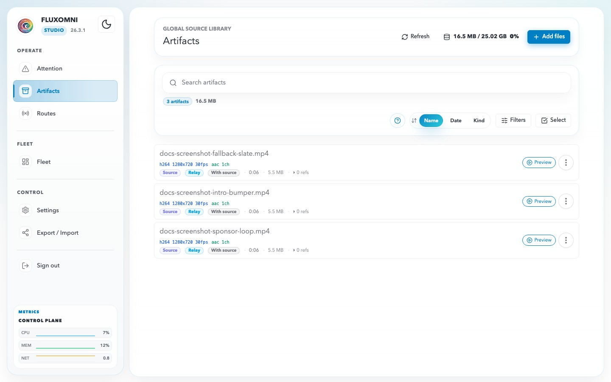
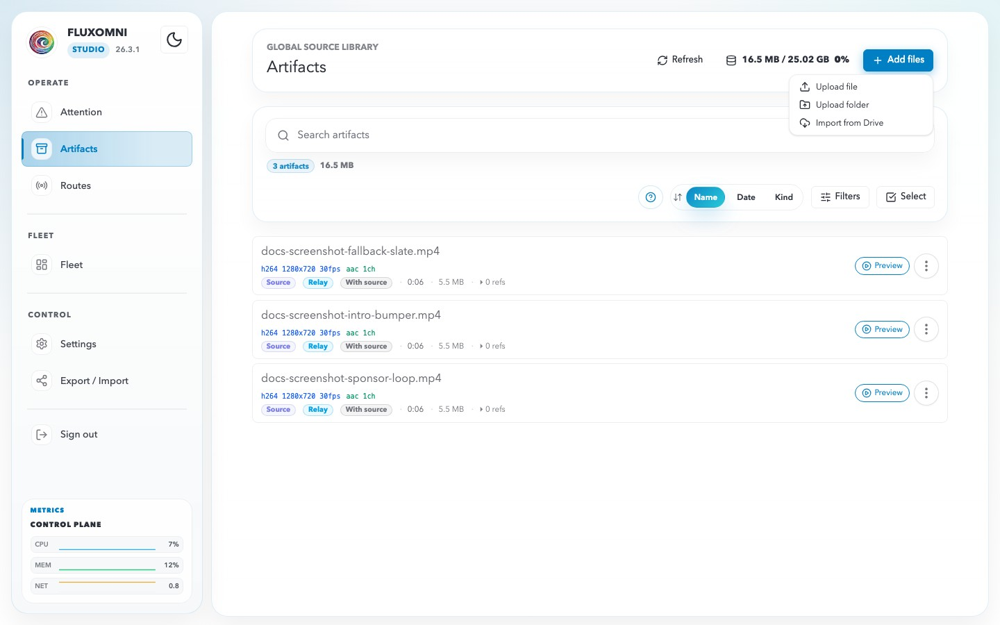
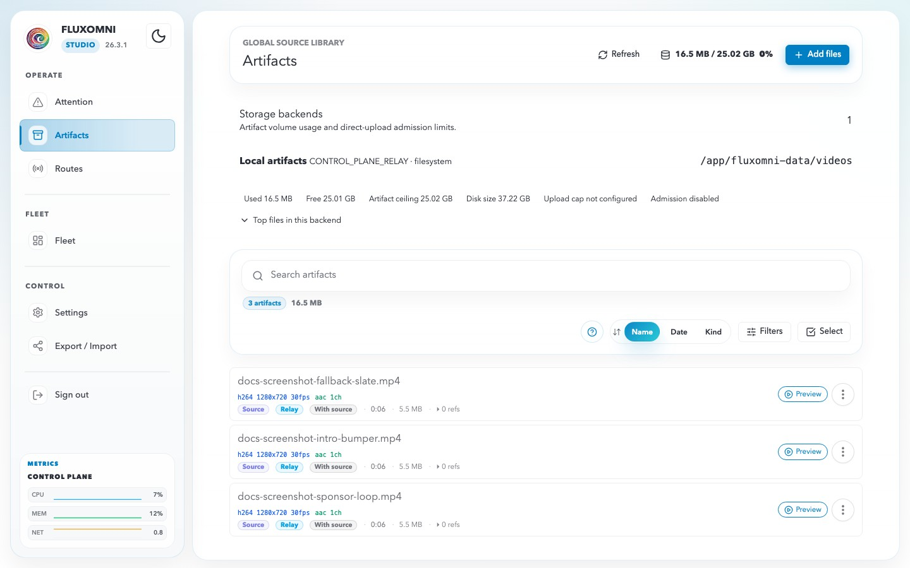

# Artifacts

Artifacts are reusable source files and generated media assets that Fluxomni tracks in a shared library. Use this page to import files once, tag them, monitor storage capacity, and reuse them from route playlists or fallback sources.

## Artifact Library

Open **Artifacts** in the sidebar to manage the global source library.

- **Search** finds files by name or file id.
- **Tags** group files by client, show, campaign, language, or day-part.
- **Filters** narrow the library by usage, artifact kind, location, lifecycle policy, or baseline compatibility.
- **Sort** switches between name, date, and artifact kind.
- **Selection mode** enables bulk tag and delete actions.

Rows show codec status, references from routes, tags, artifact kind, durable location, and lifecycle policy. Referenced files are protected from regular delete; admins can force-delete only when they intend to break those references.

## Add Files

Use **Add files** to bring media into the library.

The menu supports:

- **Upload file** — choose one or more local video files.
- **Upload folder** — choose a folder; non-video sidecars are skipped.
- **Import from Drive** — enter a Google Drive file ID or URL. Folder imports are available from playlist flows.

Uploads and imports share the same transfer drawer. The drawer shows queued files, upload progress, skipped non-video files, and storage rejections.

## Storage Backends

The storage chip in the header summarizes the control-plane relay backend used for direct uploads.

Expand the panel to inspect:

- Used and free artifact capacity.
- Raw disk size and configured headroom.
- Admission limit for new uploads.
- Outstanding reservations from in-flight transfers.
- Top artifact consumers.
- Recent storage rejection context.

Fluxomni rejects uploads before they exceed the backend admission limit. The rejected upload also appears in Attention as a storage alert so operators can free space or move content before retrying.

## Playlist Reuse

Route playlists use the same library picker. Open a route, switch to **Playlist**, then choose **From library** to add existing artifacts without uploading or importing the same file again.

The picker can filter by tags and route baseline compatibility. In multi-select mode it commits only visible, usable rows, so stale selections from prior filters are skipped instead of adding hidden files by accident.

## Operational Tips

- Use short, stable tags such as `client-acme`, `intro`, `sponsor`, or `2026-season`.
- Check the storage panel before folder uploads or Drive imports.
- Keep file backup distinct from playlist programming: file backup is the safety loop; playlist is scheduled playout.
- Use Fleet when you need to confirm whether a media node has cached artifacts required by an assigned route.
