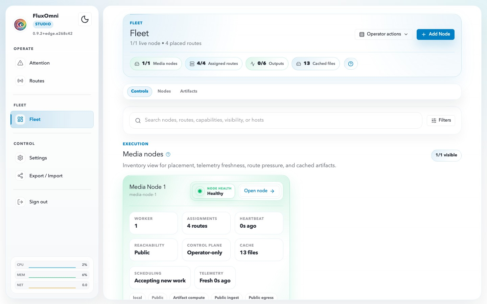

# Fleet

The Fleet page (`/fleet`) provides an inventory view of all media nodes attached to your FluxOmni instance. Use it to monitor node health, inspect capacity, and track file distribution across your infrastructure.

## Fleet Overview

The top of the Fleet page shows a summary bar with:

- **Media nodes** — total attached nodes and how many are healthy (e.g. 1/1).
- **Assigned routes** — how many routes are placed on nodes.
- **Cached files** — total files cached across the fleet.

Click **+ Add Node** to register a new media node (see the [Quick Start](../getting-started/quick-start.md#attach-another-media-node) guide for the installation command).

## Fleet Tabs

### Controls

The default view with a search bar and filters. You can search by node name, route, capabilities, visibility, or host. The main panel shows each media node as a card with live telemetry.

### Nodes

A focused list of all registered nodes.

### Artifacts

The file distribution view showing cached artifacts across the fleet.

## Media Node Card

Each media node card displays:

| Field | Description |
| ------- | ------------- |
| **Node name** | Human-readable name (e.g. "Media Node 1") |
| **Node ID** | Machine identifier (e.g. "media-node-1") |
| **Node Health** | Current health status: Healthy, Degraded, or Offline |
| **Worker** | Number of active worker processes |
| **Assignments** | Number of routes placed on this node |
| **Heartbeat** | Time since last heartbeat (e.g. "2s ago") |
| **Reachability** | Network visibility: Public or Private |
| **Control Plane** | Access mode: Operator-only or Full |
| **Cache** | Number of cached playlist files |
| **Scheduling** | Whether the node is accepting new work |
| **Telemetry** | Freshness of telemetry data |

### Capabilities

Each node advertises its supported protocols and features as tags:

- **Protocols**: RTMP, SRT, HLS, WEBRTC
- **Visibility**: Public, local
- **Functions**: Artifact compute, Public ingest, Public egress, Ingest Public, Egress Public

### Routes

Below the capabilities, you can see which routes are currently placed on this node.

## File Distribution (Artifacts)

The Artifacts section provides a fleet-wide view of file caching:

- **Cached artifacts** — total files cached across all nodes.
- **Nodes with gaps** — nodes that are missing files required by their assigned routes.
- **Blocked routes** — routes that cannot start because required files are not cached on the assigned node.

The distribution table shows per-node, per-route breakdowns of required, cached, and missing files with an overall status (Applied, Pending, etc.).

## Opening a Node

Click **Open node →** on any media node card to view detailed node information, including full telemetry, route assignments, and cached file inventory.
