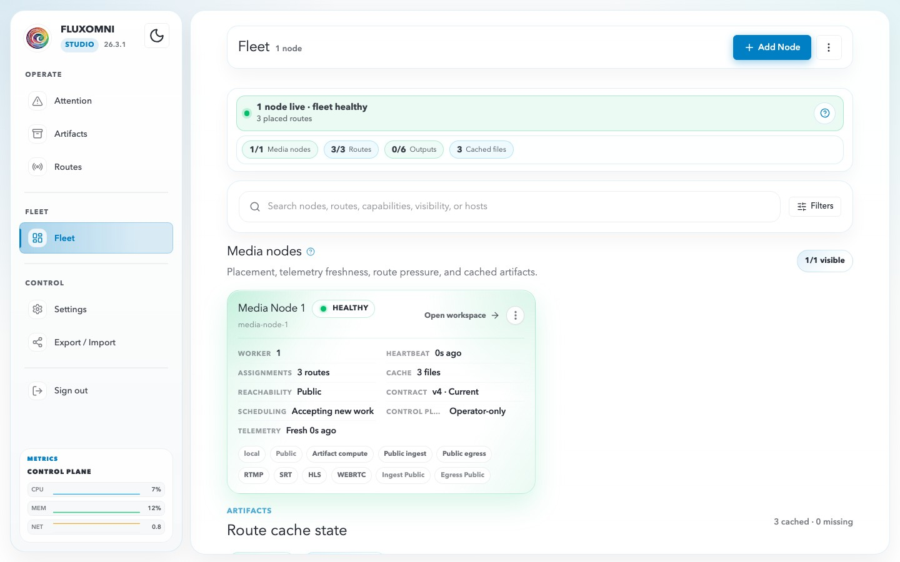

# Fleet

The Fleet page (`/fleet`) provides an inventory view of all media nodes attached to your Fluxomni Studio instance. Use it to monitor node health, inspect capacity, and confirm which artifacts are cached where.

## Fleet Overview

The top of the Fleet page shows a summary bar with:

- **Media nodes** — total attached nodes and how many are healthy (e.g. 1/1).
- **Assigned routes** — how many routes are placed on nodes.
- **Cached files** — total artifact files currently cached across the fleet.

Click **+ Add Node** to register a new media node (see the [Quick Start](../getting-started/quick-start.md#attach-another-media-node) guide for the installation command).

## Fleet Tabs

### Controls

The default view with a search bar and filters. You can search by node name, route, capabilities, visibility, or host. The main panel shows each media node as a card with live telemetry.

### Nodes

A focused list of all registered nodes.

### Artifacts

The cache distribution view for artifacts required by assigned routes. Use the separate [Artifacts page](artifacts.md) to upload, import, tag, delete, or inspect library storage.

## Media Node Card

Each media node card displays:

| Field | Description |
| ------- | ------------- |
| **Node name** | Human-readable name (e.g. "Media Node 1") |
| **Node ID** | Machine identifier (e.g. "media-node-1") |
| **Node Health** | Current health status: Healthy, Degraded, or Offline |
| **Worker** | Number of active worker processes |
| **Assignments** | Number of routes placed on this node |
| **Heartbeat** | Time since last heartbeat (e.g. "2s ago") |
| **Reachability** | Network visibility: Public or Private |
| **Control Plane** | Access mode: Operator-only or Full |
| **Cache** | Number of cached artifacts on the node |
| **Scheduling** | Whether the node is accepting new work |
| **Telemetry** | Freshness of telemetry data |

### Capabilities

Each node advertises its supported protocols and features as tags:

- **Protocols**: RTMP, SRT, HLS, WEBRTC
- **Visibility**: Public, local
- **Functions**: Artifact compute, Public ingest, Public egress, Ingest Public, Egress Public

### Routes

Below the capabilities, you can see which routes are currently placed on this node.

## File Distribution (Artifacts)

The Fleet **Artifacts** section is operational visibility for node caches, not the shared library editor. It helps answer whether each assigned route's required artifacts have reached the node that will play them.

- **Cached artifacts** — total files cached across all nodes.
- **Nodes with gaps** — nodes that are missing files required by their assigned routes.
- **Blocked routes** — routes that cannot start because required files are not cached on the assigned node.

The distribution table shows per-node, per-route breakdowns of required, cached, and missing files with an overall status (Applied, Pending, etc.).

If a row shows a baseline compatibility status such as **Compatible**, **Incompatible**, or **Unknown**, the exact preset definitions live in [Settings → Media profiles](settings.md#media-profiles). Fleet shows whether required files are present on nodes; profile definitions explain why a file may or may not match the route's expected media shape.

For library operations, use:

- [Artifacts](artifacts.md) — upload files, import from Drive, tag assets, inspect storage, and reuse files in playlists or file-backup sources.
- [Settings → Artifacts](settings.md#artifacts) — configure Google Drive imports and shared file-operation limits.
- [Settings → Media profiles](settings.md#media-profiles) — review the baseline presets used by route, playlist, and artifact compatibility checks.

## Opening a Node

Click **Open node →** on any media node card to view detailed node information, including full telemetry, route assignments, and cached file inventory. Use [Attention](attention.md) to triage node conditions that need action before returning to node diagnostics.
