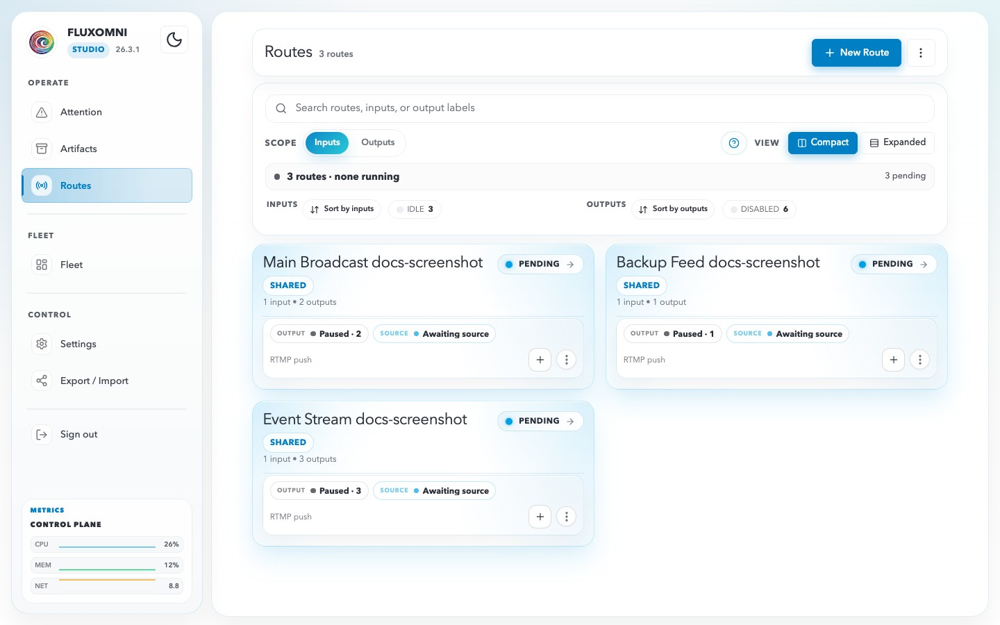

# User Guide

Fluxomni is a web-based RTMP streaming platform that lets you broadcast a single source to multiple destinations simultaneously. The operator interface — called the **Control Surface** — runs in your browser and gives you real-time control over route health, outputs, playlists, media-node inventory, and local-user administration.

This guide covers the day-to-day operation of the Control Surface after your Fluxomni instance is installed and running. For installation and deployment, see the [Quick Start](../getting-started/quick-start.md) section.

## Key Concepts

**Route** — a named streaming pipeline that connects one ingest input to one or more output destinations. Each route has its own workspace where you manage execution, routing, playlists, and live playback.

**Input** — the ingest endpoint where your source signal arrives. Fluxomni generates a unique URL for each route depending on the chosen protocol (RTMP, SRT, or WebRTC). Point your encoder (OBS, FFmpeg, hardware encoder) at this URL.

**Output** — a destination where Fluxomni relays the ingested signal. Outputs are typically RTMP URLs for platforms like YouTube, Twitch, Facebook Live, or custom CDN endpoints.

**Media Node** — a server that handles the actual media processing (transcoding, relaying, file playback). A single-host install runs one media node automatically. Larger deployments can attach multiple media nodes across different servers.

**Fleet** — the collective view of all attached media nodes, their health, capacity, and cached files.

**Playlist** — a queue of pre-recorded video files that a route can play out through its outputs, useful for scheduled programming or fallback content.

**Artifact** — a reusable source file or generated media asset tracked in the shared library. Artifacts can be uploaded once, tagged, monitored for storage usage, and reused from playlists or file-backup sources.

## Control Surface Layout

When you open the Control Surface, you see a persistent sidebar on the left with the Fluxomni logo, version badge, theme toggle, navigation menu, sign-out action, and live system metrics. The main content area on the right changes based on the current page.

### Operate

- **Attention** — a unified alert feed for route alerts, fleet alerts, and acknowledged known issues. Each route alert links directly to the affected workspace.
- **Routes** — the main operational view. Combines search, scope toggles, health strips, route cards, and quick output actions.
- **Artifacts** — the shared source-file library for uploads, Drive imports, tags, storage admission, and playlist reuse.

### Fleet

- **Fleet** — inventory of all media nodes. Shows node health, assignments, heartbeat freshness, reachability, capabilities, and cached file distribution.

### Control

- **Settings** — a role-scoped settings workspace for general defaults, artifact ingest settings, media-profile references, session security, and user administration.
- **Export / Import** — bulk export or import of route configurations.

### System Metrics

The bottom of the sidebar shows real-time CPU, memory, and network utilization for the control plane.

## Next Steps

- [Routes](routes.md) — learn how to create and operate routes
- [Artifacts](artifacts.md) — upload and reuse source files across routes
- [Fleet](fleet.md) — understand media node management
- [Settings](settings.md) — configure your Fluxomni instance
