# Routes

Routes are the core of FluxOmni. Each route is an independent streaming pipeline with its own ingest input, one or more outputs, an optional playlist, and a live playback monitor.

## Routes List

Navigate to **Routes** in the sidebar (or visit `/routes`) to see all configured routes.

- The page header summarizes route count, live-input health, output health, and quick operator actions.
- The **Controls** view combines search, scope selection, view mode, and health chips for inputs, signal integrity, and outputs.
- The **Routes** view strips the collection controls back and focuses on the route cards themselves.

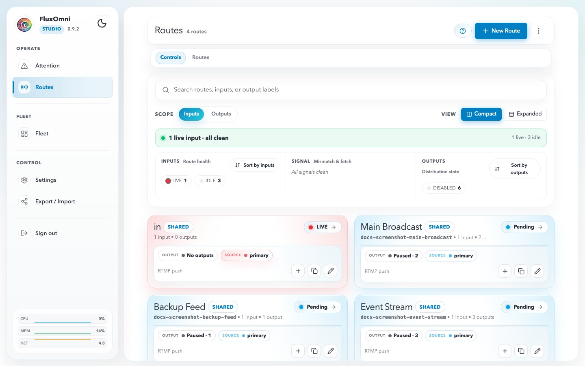

### Collection controls

The Controls view gives you the fastest way to triage the whole system:

- **Search** — find routes by route label, input label, or output label.
- **Scope** — switch the search focus between **Inputs** and **Outputs**.
- **View mode** — choose **Compact** or **Expanded** cards.
- **Health strip** — shows whether the current slice is live, idle, clean, or needs attention.
- **Inputs / Signal / Outputs groups** — summarize route health, mismatch or fetch issues, and distribution state without opening each route.

### Route cards

Each card shows the route label, ownership scope, current source, input and output state, and quick actions:

- **Open workspace →** jumps into the full route workspace.
- **+ Add output** opens the output modal directly from the card.
- **Copy** duplicates the route configuration.
- **Edit** opens the route modal.

## Creating a Route

Click **+ New Route** on the routes list page (or the empty-state create prompt) to open the route setup dialog.

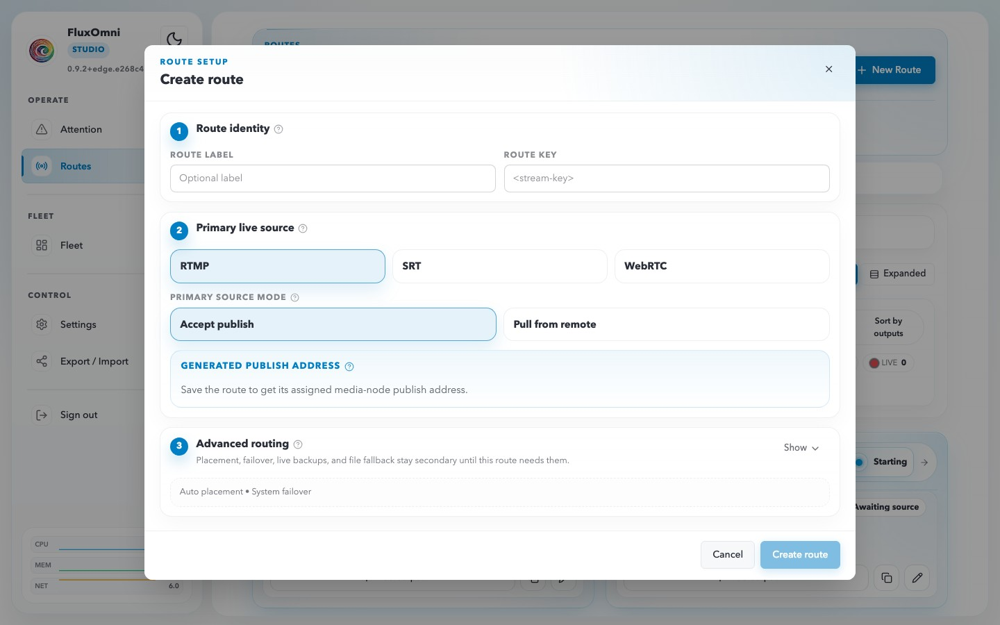

The dialog is organized into three steps.

### 1. Route Identity

- **Route Label** — a human-readable name for the route, such as `Main broadcast`.
- **Owner** — for admins, choose whether the route stays **Shared** or is assigned to a named user. Shared routes are visible to every signed-in user; owned routes stay scoped to their assignee plus admins.

The route key and publish key are generated automatically when the route is saved.

### 2. Primary Live Source

Choose the ingest protocol for the route:

- **RTMP** — the best default for OBS, FFmpeg, and most hardware encoders.
- **SRT** — useful for contribution over less stable networks.
- **WebRTC** — low-latency browser publishing.

Then choose the source mode:

- **Accept publish** — FluxOmni generates an ingest address and waits for a publisher to push into it.
- **Pull from remote** — FluxOmni fetches a remote source URL itself.

The **Generated publish address** area becomes actionable after the route is saved and assigned to a media node.

### 3. Advanced Routing

Leave **Advanced routing** collapsed for the normal setup path, or expand it when the route needs custom runtime behavior:

- **Execution placement** — keep auto-placement or pin the route to a specific media node.
- **Failover policy** — stay on system defaults or customize stickiness and cooldown behavior.
- **Live backups** — add additional ingest paths in the same live protocol family.
- **File backup** — configure a Google Drive file as a last-resort fallback when no live source is available.

### Step-by-step: create a route

1. Start from the Routes page.

   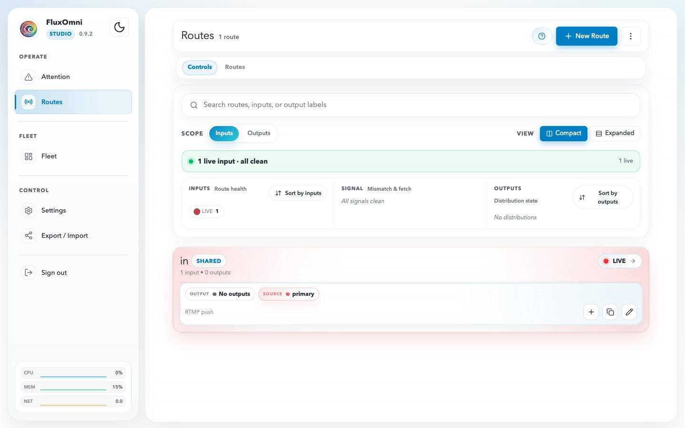

2. Open **+ New Route**.

   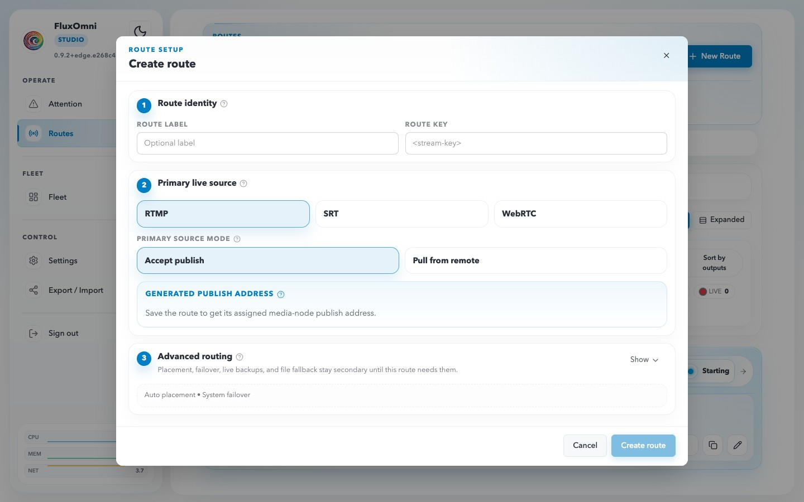

3. Fill the route identity fields.

   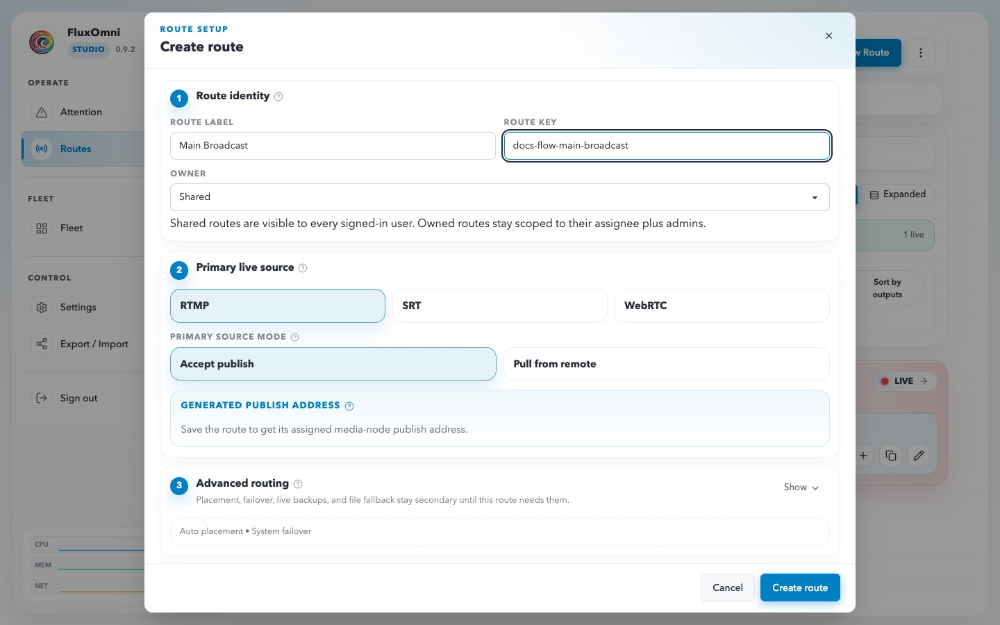

4. Submit the form to create the route.

   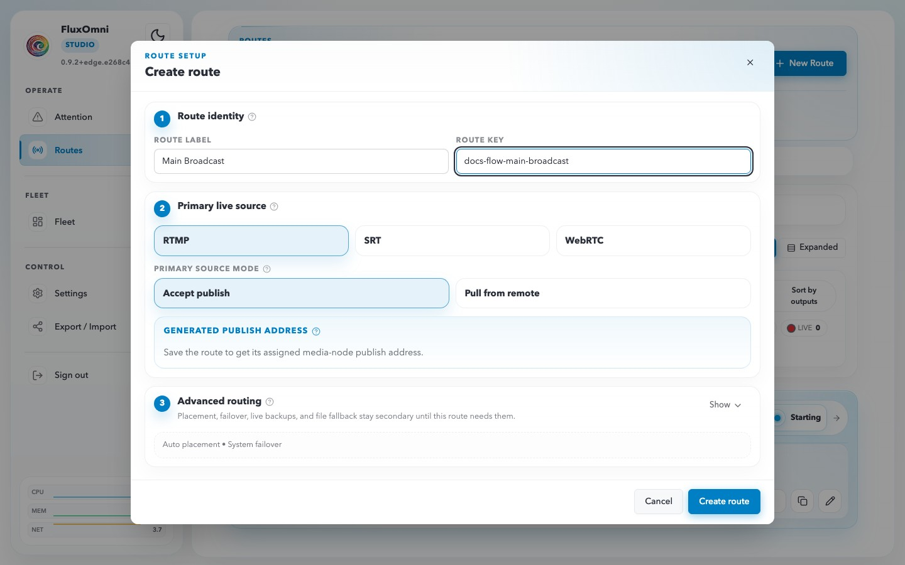

## Route Workspace

Click **Open workspace →** on any route card to enter the route workspace.

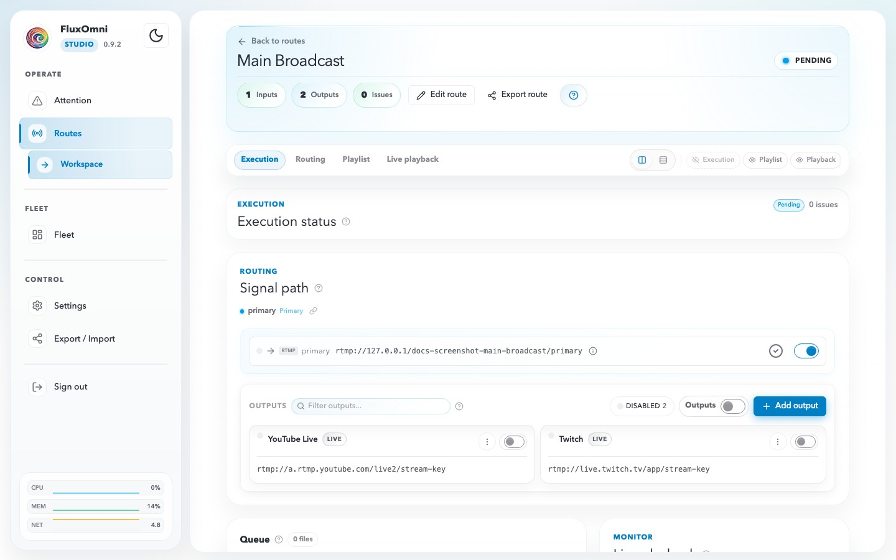

The workspace header shows the route name, status badge, quick actions, route key, input count, output count, and current issue count.

The workspace has four tabs:

### Execution

The **Execution** tab answers where the route is running and what the control plane currently knows about it.

- **Assigned node** — the selected media node, its advertised endpoints, and a shortcut to node diagnostics.
- **Manifest delivery** — whether the desired runtime plan has been applied.
- **Observed runtime** — the latest runtime-side execution signal, including pending or degraded states.

### Routing

The **Routing** tab is the operational signal-path view.

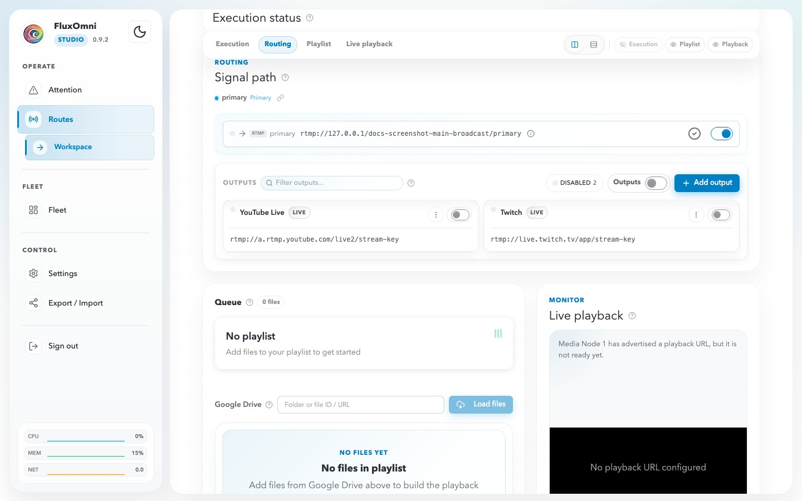

- **Active source chip** — shows whether the route is awaiting source, live, playing from playlist, or running from fallback.
- **Inputs lane** — displays the primary ingress and any live backups, with enable/disable controls and copyable ingest addresses.
- **Outputs lane** — lists every destination with per-output state, filtering, bulk enable/disable, and the **+ Add output** action.
- **Queue / Playlist** — the file-playout controls remain visible below the routing surface.
- **Live playback** — the browser preview stays docked on the right when a playback URL exists.

### Step-by-step: add an output

1. Open the route workspace and switch to **Routing**.

   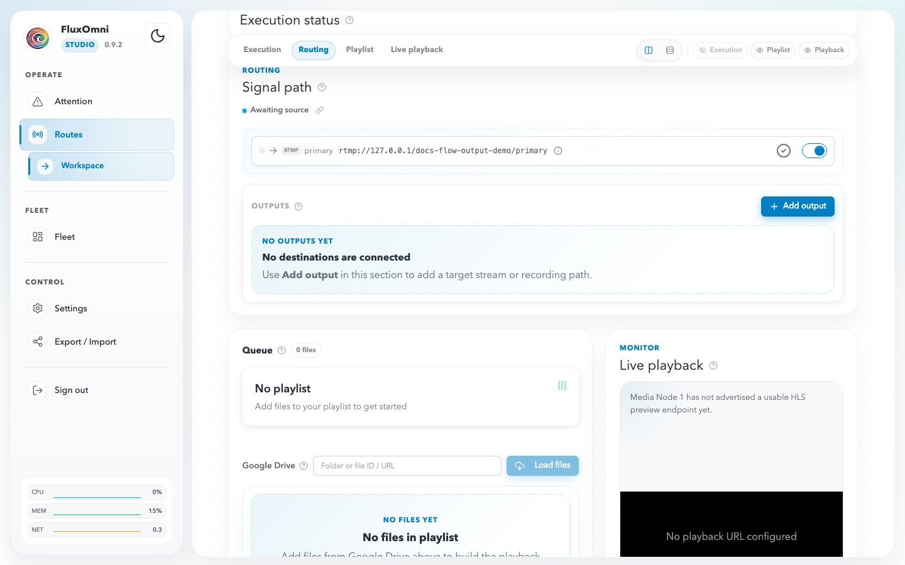

2. Click **+ Add output** to open the destination modal.

   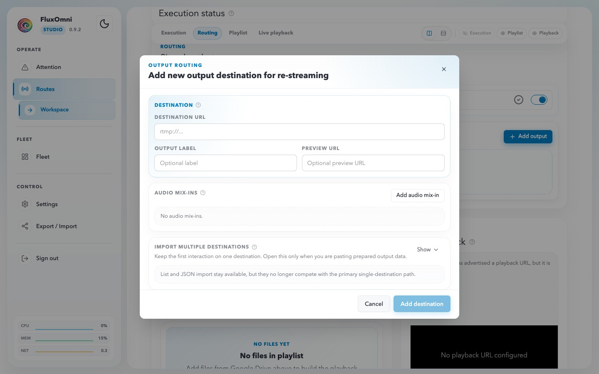

3. Enter the destination URL and an optional label, then save.

   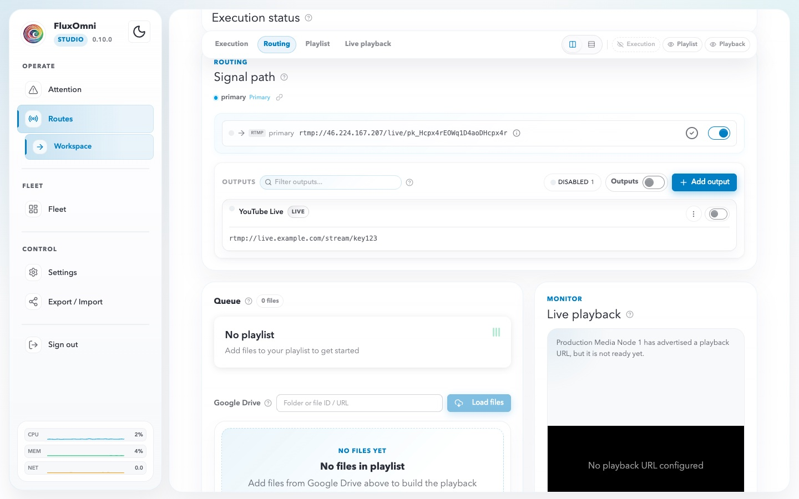

The output dialog also supports:

- **Preview URL** — an optional URL associated with that destination.
- **Audio mix-ins** — extra MP3 or TeamSpeak audio sources mixed into the output.
- **Import multiple destinations** — a bulk path for pasting a list or JSON payload of outputs.

### Editing advanced routing

Click **Edit route** in the workspace header to reopen the route modal with the current route values.

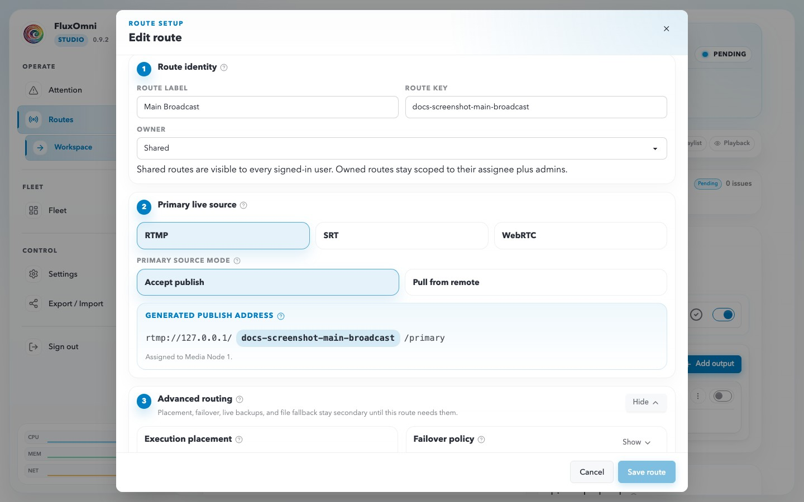

This is where admins and operators revisit placement, failover, live backups, and file fallback after the route is already running.

### Playlist

The **Playlist** tab manages file-based playout for the route:

- **Now playing** — current file, codec summary, progress, and transport controls.
- **Queue status** — readiness, local-file count, mismatch warnings, and stream errors.
- **Google Drive import** — load files from a Drive folder or file URL/ID, then start downloads to the assigned media node.
- **File list** — codec metadata plus signal-integrity badges such as **REF**, **DIFF**, or **ERROR**.

### Live Playback

The **Live playback** tab embeds the HLS monitor for the route's output. When a playback URL is available and the route is live, you can inspect the outgoing stream directly in the Control Surface.

## Output Protocols

When adding an output destination, FluxOmni supports several destination URL families:

- **RTMP / RTMPS** — the common choice for YouTube, Twitch, Facebook Live, and custom RTMP servers.
- **SRT** — useful for contribution or delivery over less predictable networks.
- **Icecast** — for Icecast-compatible audio publishing.
- **File** — `file:///` destinations for writing FLV, WAV, or MP3 output to disk.

## Mix-ins (Audio Mixing)

Outputs support **mix-ins** — extra audio sources mixed into the output before it reaches the destination. Use them for background music, commentary, or TeamSpeak/VoIP audio.

Each mix-in can define:

- **Source URL** — an HTTP(S) MP3 URL or TeamSpeak source.
- **Volume** — gain control for the added source.
- **Delay** — an optional offset before the mix-in starts.
- **Sidechain** — ducking that lowers the mix-in when the main route audio is active.

## Alerts

Route-level and fleet-level issues surface on the **Attention** page.

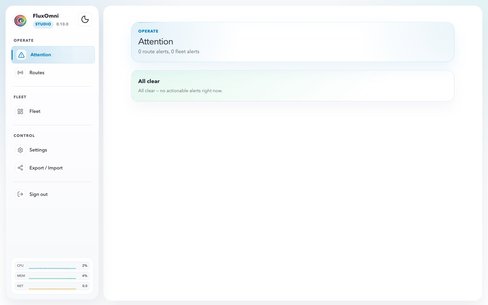

When active issues exist, FluxOmni groups them into **Route alerts** and **Fleet alerts**. Operators can mark items as **Known** to move them into the muted known-issues area without keeping the sidebar urgency badge lit forever. When nothing is active, the page collapses to the all-clear state shown above.

Alert severity levels include:

- **Critical** — route or fleet conditions that need immediate action.
- **Attention** — warnings, mismatches, or degraded conditions that still need review.

Use **Open route** on route alerts to jump directly into the affected workspace.
