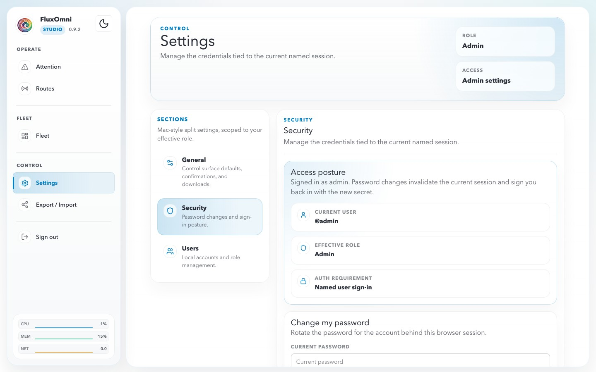
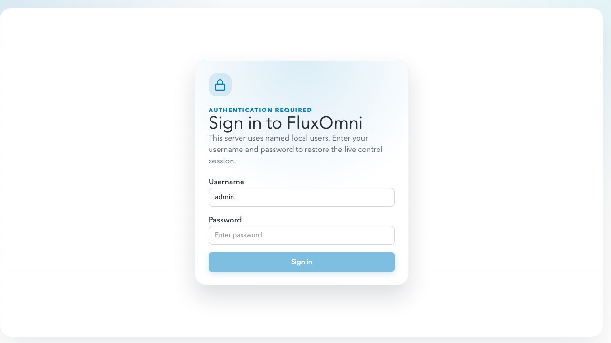
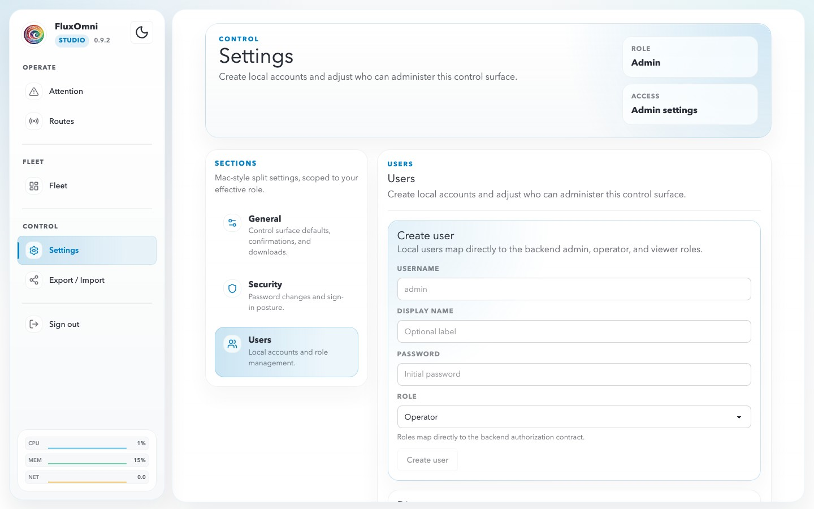

# Settings

The Settings workspace (`/settings`) is where FluxOmni exposes server defaults, self-service account information, and local user administration. Access it from **Settings** in the sidebar.

The page uses a split layout:

- a persistent **section rail** on the left
- a **hero card** at the top showing your current **Role** and **Access** level
- a large **content panel** for the selected section on the right

Admins can reach **General**, **Security**, and **Users**. Operators stay limited to the self-service **General** and **Security** sections.

## General

The **General** section contains control-surface defaults plus a read-only shell summary. Admins can edit the shared defaults here; Operators see the same section as a self-service reference surface.

### Control surface defaults

These settings affect the shared operator experience:

- **Title** — the server name shown in the browser tab and shared shell chrome.
- **Confirm deletion actions** — requires confirmation before destructive actions such as deleting routes, outputs, or files.
- **Confirm enable and disable actions** — adds confirmation before toggling inputs or outputs on or off.

### Google Drive

Google Drive settings control file ingest for route playlists:

- **Google API Key** — required before operators can load files from Google Drive.
- **Files Limit** — maximum concurrent downloads when Drive ingest is in use.

### Live shell summary

The lower summary cards mirror the current shell-level values visible to the operator:

- **Public host**
- **Delete confirmation**
- **Enable confirmation**
- **Sign-in mode**

## Security

The **Security** section is focused on the current browser session and its authentication posture.

### Access posture

The top card shows the current auth boundary for this session:

- **Current user** — the signed-in username, or the open admin shell when auth is disabled.
- **Effective role** — the resolved role for the current session.
- **Auth requirement** — whether the server is running in **Named user sign-in** mode or **Open shell** mode.

### Change my password

When you are signed in as a named local user, use the password form to rotate that account's password. FluxOmni invalidates the current session and signs the browser back in with the new password once the change succeeds.

### Sign-in screen

When named-user auth is required, unauthenticated browsers land on the sign-in screen shown below.

Creating the first persisted admin user is what flips a fresh open-shell install into named-user sign-in mode.

## Users

The **Users** section is admin-only and manages local accounts plus route ownership.

### Create user

Use the creation card to add a local account:

- **Username** — login name for the operator
- **Display Name** — optional friendly label
- **Password** — initial password
- **Role** — Admin, Operator, or Viewer

On a brand-new open-shell install, the very first persisted user is always promoted to **Admin** and immediately becomes the account that enables named-user auth.

### Directory

The Directory card lists all local accounts with their:

- display name or username
- role badge
- last login timestamp
- controls to **Update role** or **Delete** the user

Changing your own role or deleting your own account forces the shell to reload under the new auth boundary.

### Route ownership

FluxOmni routes can be either **Shared** or owned by a single named user.

- **Shared routes** remain visible to every signed-in user.
- **Owned routes** stay scoped to their assignee plus admins.
- Admins can assign or clear ownership from the route modal and from the route-ownership panels in **Users**.
- If a user is deleted, any routes they owned fall back to shared scope.

The Users page organizes this with per-user **Route ownership** panels plus a **Shared routes** section for reassigning unowned routes.

### User roles

FluxOmni has three built-in roles:

| Role | Access |
| ---- | ------ |
| **Admin** | Full access to routes, fleet, settings, user management, export/import, and ownership assignment. |
| **Operator** | Can create and manage routes, playlists, and outputs for routes they can see. Operators only get self-service Settings sections. |
| **Viewer** | Read-only access to visible routes and system surfaces. |

## Export / Import

Accessible from **Export / Import** in the sidebar, this page lets you bulk export or import route configurations. Use it to:

- back up your routing configuration before major changes
- migrate routes between FluxOmni instances
- share route templates with other operators
