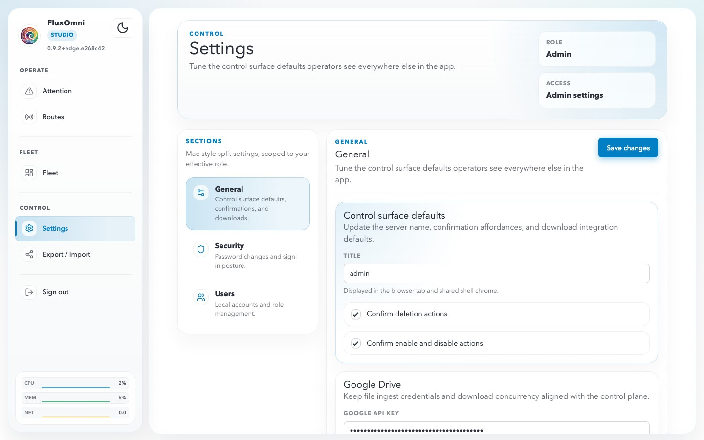

# Settings

The Settings page (`/settings`) lets administrators configure the Control Surface behavior, security posture, and user accounts. Access it from **Settings** in the sidebar.

The page header shows your current **Role** (e.g. Admin) and **Access** level (e.g. Admin settings). Settings are organized into sections scoped to your effective role.

## General

**Control surface defaults** configure how the operator interface behaves across all users:

- **Title** — the server name displayed in the browser tab and shared shell chrome. Set this to something meaningful like your organization name or stream label.
- **Confirm deletion actions** — when enabled, destructive operations (deleting routes, outputs, files) require an explicit confirmation dialog.
- **Confirm enable and disable actions** — when enabled, toggling inputs or outputs on/off requires confirmation. Useful for production environments where accidental toggles could disrupt a live broadcast.

**Google Drive** settings control file ingest from Google Drive:

- **Google API Key** — required before operators can load files from Google Drive into route playlists. Obtain an API key from the Google Cloud Console with the Drive API enabled.
- **Files Limit** — maximum number of concurrent downloads when Google Drive ingest is active.

**Live shell summary** shows read-only values propagated through the shared authenticated shell:

- **Public Host** — the domain or IP the instance is accessible at.
- **Delete Confirmation** — whether the deletion confirmation toggle is active.
- **Enable Confirmation** — whether the enable/disable confirmation toggle is active.
- **Sign-in Mode** — current authentication posture (e.g. "Named users required").

## Security

Password changes and sign-in posture configuration:

- Change the admin password.
- Configure sign-in requirements (whether named user accounts are required or anonymous access is allowed).

## Users

Local account and role management:

- Create, edit, and remove user accounts.
- Assign roles that control what each user can see and modify in the Control Surface.

## Export / Import

Accessible from **Export / Import** in the sidebar, this page lets you bulk export or import route configurations. Use this to:

- Back up your routing configuration before major changes.
- Migrate routes between FluxOmni instances.
- Share route templates with other operators.
