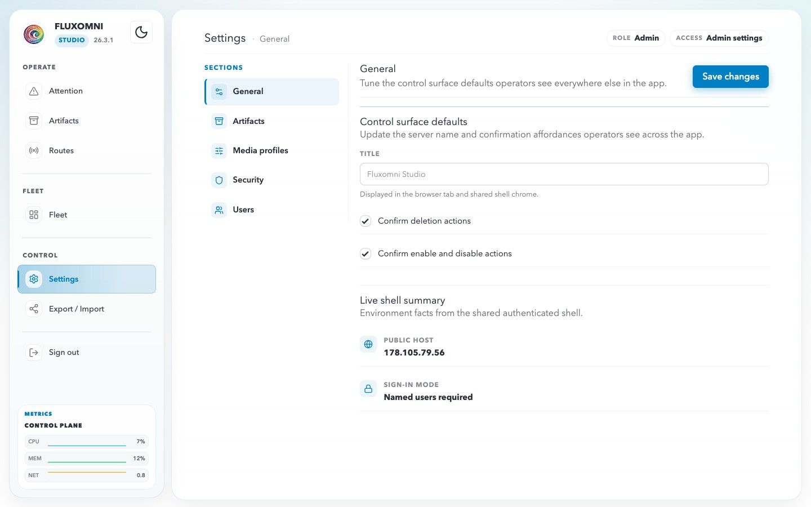
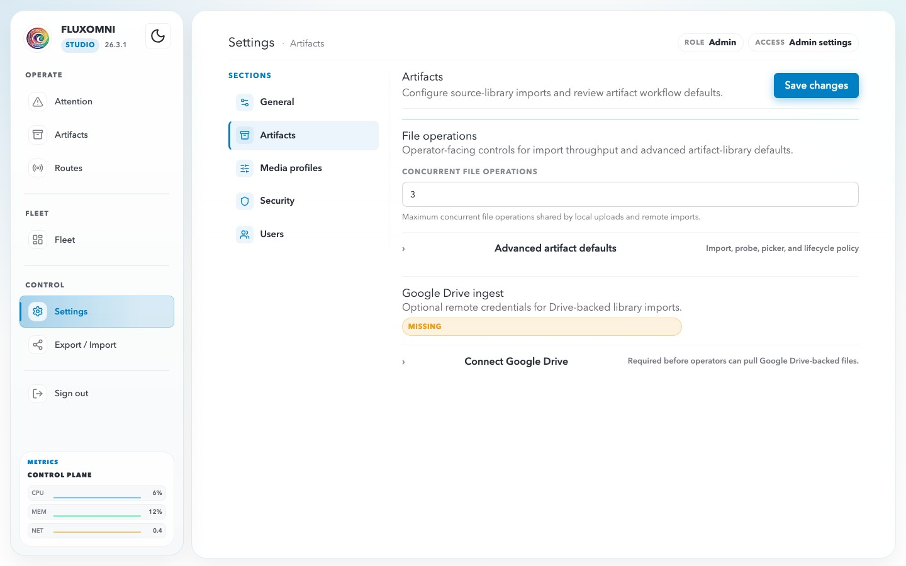
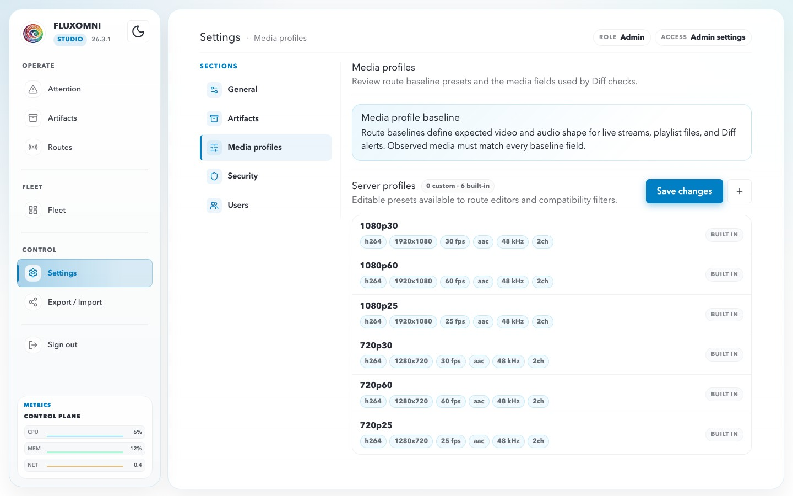
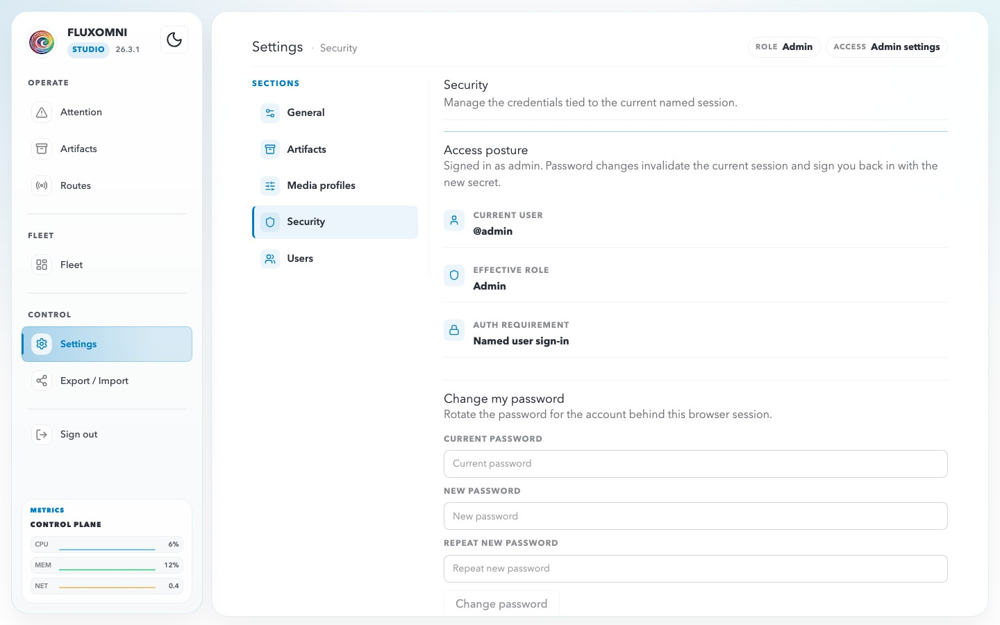
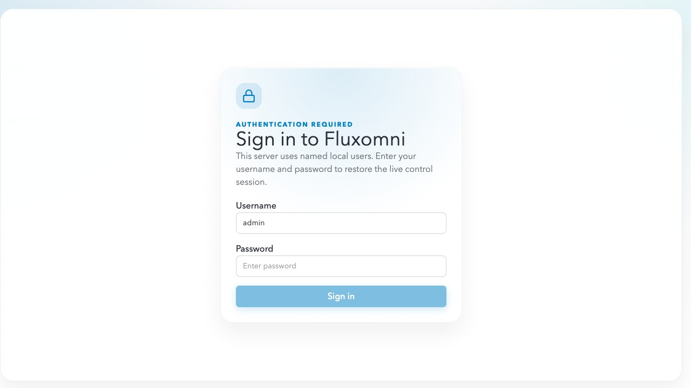
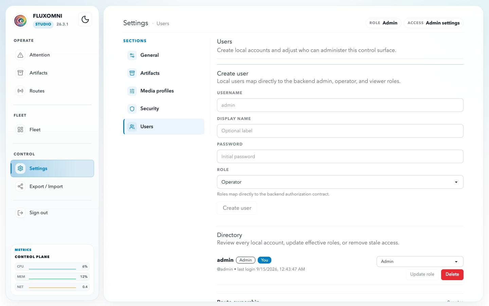

# Settings

The Settings workspace (`/settings`) is where Fluxomni Studio exposes server defaults, artifact ingest settings, media-profile references, self-service account information, and local user administration. Access it from **Settings** in the sidebar.

The page uses a split layout:

- a persistent **section rail** on the left
- a **hero card** at the top showing your current **Role** and **Access** level
- a large **content panel** for the selected section on the right

Admins can reach **General**, **Artifacts**, **Media profiles**, **Security**, and **Users**. Operators stay limited to the self-service **General** and **Security** sections.

## General

The **General** section contains control-surface defaults plus a read-only shell summary. Admins can edit the shared defaults here; Operators see the same section as a self-service reference surface.

### Control surface defaults

These settings affect the shared operator experience:

- **Title** — the server name shown in the browser tab and shared shell chrome.
- **Confirm deletion actions** — requires confirmation before destructive actions such as deleting routes, outputs, or files.
- **Confirm enable and disable actions** — adds confirmation before toggling inputs or outputs on or off.

### Live shell summary

The lower summary cards mirror the current shell-level values visible to the operator:

- **Public host**
- **Delete confirmation**
- **Enable confirmation**
- **Sign-in mode**

## Artifacts

The **Artifacts** settings section is admin-only and controls ingest defaults for the shared media library. Use the separate [Artifacts page](artifacts.md) for day-to-day uploads, imports, tags, storage review, and playlist reuse.

### Google Drive

Google Drive settings control Drive imports into the artifact library and route playlist flows:

- **Google API Key** — required before operators can import shared Drive files or folders.
- **Files Limit** — maximum concurrent file operations for local uploads and remote imports.

#### Get an API key

Fluxomni Studio uses a Google Drive **API key**, not an OAuth user token. The key lets the control plane list and download files that are already shared with link access.

To create one:

1. Open the official Google Workspace credential guide: [Create access credentials](https://developers.google.com/workspace/guides/create-credentials#api-key).
2. In Google Cloud Console, create or select a project.
3. Open **APIs & Services → Library**, search for **Google Drive API**, and enable it for the project.
4. Open **APIs & Services → Credentials** and choose **Create credentials → API key**.
5. Copy the generated key into **Settings → Artifacts → Google Drive → Google API Key** in Fluxomni Studio.
6. Recommended: restrict the key to the **Google Drive API** in Google Cloud Console. If your deployment has a stable public egress IP, also restrict usage to that IP.

Drive files and folders must be shared so the key can read them. Use link sharing such as **Anyone with the link can view** for the folders/files you import. Private files that require a signed-in Google account are not available through this API-key flow.

### Artifact workflow defaults

The remaining cards are read-only reminders for the current artifact workflow:

- library uploads and Drive imports land in the shared artifact catalog
- route playlists and file-backup sources reuse the same library picker
- storage admission and rejections are visible from the Artifacts page and Attention feed
- media nodes cache artifacts as runtime state; the control plane remains the durable catalog authority

## Media Profiles

The **Media profiles** settings section is admin-only and lists the baseline presets Fluxomni Studio uses when checking route playlist compatibility.

Profiles are reference presets, not encoder controls. They describe the video and audio shape a route expects before playlist files are allowed to start or stay healthy. The current presets cover common H.264/AAC stereo 48 kHz broadcast shapes:

- `1080p30`
- `1080p60`
- `1080p25`
- `720p30`
- `720p60`
- `720p25`

Each row shows the comparable fields Fluxomni Studio checks:

- video codec
- width and height
- frame rate
- audio codec
- audio sample rate
- audio channel count

Use this section when a route, playlist item, or artifact row shows a **Compatible**, **Incompatible**, or **Unknown** baseline status. Route workspaces and artifact pickers surface the quick status; Settings → Media profiles explains the exact profile contract those checks are comparing against.

## Security

The **Security** section is focused on the current browser session and its authentication posture.

### Access posture

The top card shows the current auth boundary for this session:

- **Current user** — the signed-in username, or the open admin shell when auth is disabled.
- **Effective role** — the resolved role for the current session.
- **Auth requirement** — whether the server is running in **Named user sign-in** mode or **Open shell** mode.

### Change my password

When you are signed in as a named local user, use the password form to rotate that account's password. Fluxomni Studio invalidates the current session and signs the browser back in with the new password once the change succeeds.

### Sign-in screen

When named-user auth is required, unauthenticated browsers land on the sign-in screen shown below.

Creating the first persisted admin user is what flips a fresh open-shell install into named-user sign-in mode.

## Users

The **Users** section is admin-only and manages local accounts plus route ownership.

### Create user

Use the creation card to add a local account:

- **Username** — login name for the operator
- **Display Name** — optional friendly label
- **Password** — initial password
- **Role** — Admin, Operator, or Viewer

On a brand-new open-shell install, the very first persisted user is always promoted to **Admin** and immediately becomes the account that enables named-user auth.

### Directory

The Directory card lists all local accounts with their:

- display name or username
- role badge
- last login timestamp
- controls to **Update role** or **Delete** the user

Changing your own role or deleting your own account forces the shell to reload under the new auth boundary.

### Route ownership

Fluxomni Studio routes can be either **Shared** or owned by a single named user.

- **Shared routes** remain visible to every signed-in user.
- **Owned routes** stay scoped to their assignee plus admins.
- Admins can assign or clear ownership from the route modal and from the route-ownership panels in **Users**.
- If a user is deleted, any routes they owned fall back to shared scope.

The Users page organizes this with per-user **Route ownership** panels plus a **Shared routes** section for reassigning unowned routes.

### User roles

Fluxomni Studio has three built-in roles:

| Role | Access |
| ---- | ------ |
| **Admin** | Full access to routes, fleet, settings, user management, export/import, and ownership assignment. |
| **Operator** | Can create and manage routes, playlists, and outputs for routes they can see. Operators only get self-service Settings sections. |
| **Viewer** | Read-only access to visible routes and system surfaces. |

## Export / Import

Accessible from **Export / Import** in the sidebar, this page lets you bulk export or import route configurations. Use it to:

- back up your routing configuration before major changes
- migrate routes between Fluxomni Studio instances
- share route templates with other operators
